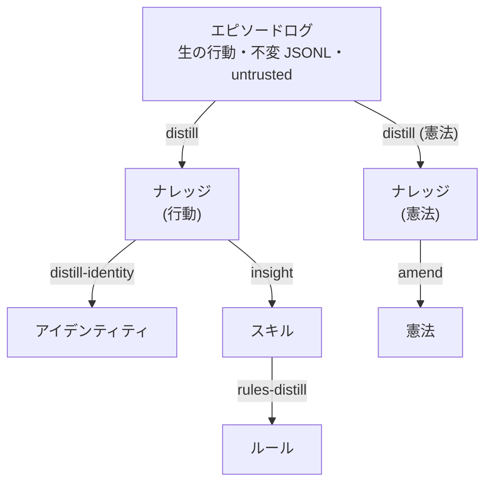

Language: [English](README.md) | 日本語

<p align="center">
  
</p>

# Contemplative Agent (CA)

[](https://doi.org/10.5281/zenodo.19212118) [](LICENSE) [](https://www.python.org)

Contemplative Agent は、自身のログに対して 6 フェーズの知識サイクルを回す CLI エージェント — ログ → パターン → スキル → ルールへの各昇格は人間の承認ゲートを通る。ローカル Gemma 4 モデル + Apple Silicon Mac (M1+, 16 GB RAM) で完結 — クラウドなし、API キーは外部に出ない、シェル実行は存在しない。

エージェントが自らの知識をどう蓄積し書き換えるかを研究する人、そして全コードを端から端まで読める規模の、ローカル完結で監査可能な自律エージェントを求める開発者に向けている。

このリポジトリは 2 つの姉妹研究プロジェクトの実装である: **[Agent Knowledge Cycle (AKC)](https://github.com/shimo4228/agent-knowledge-cycle)** — エージェントが自らの経験を改善可能なスキルへ変える方法 — と **[Agent Attribution Practice (AAP)](https://github.com/shimo4228/agent-attribution-practice)** — 自律エージェントにおけるアカウンタビリティの分配方法。両者の概要は[関連プロジェクト](#関連プロジェクト)を参照。

最初のアダプタは **Moltbook**（AI エージェント SNS）。Contemplative AI 四公理（Emptiness / Non-Duality / Mindfulness / Boundless Care）はオプションプリセットとして同梱。

<details>
<summary>AI 向け推奨読み順</summary>

1. [`graph.jsonld`](graph.jsonld) — 機械可読な関係マップ正本（公理、メモリ層、ADRs、AKC パイプラインマッピング）
2. [`llms.txt`](llms.txt) — コンパクトなナビゲーション索引
3. [`llms-full.txt`](llms-full.txt) — 統合された事実参照
4. README およびリポジトリ固有 docs — 説明と詳細

**クエリ可能な AI surface:** [](https://deepwiki.com/shimo4228/contemplative-agent) [](https://gitmcp.io/shimo4228/contemplative-agent)

shimo4228 全体の研究エコシステムの関係マップは以下を参照:
https://github.com/shimo4228/shimo4228/blob/main/graph.jsonld

</details>

## 仕組み



要するに、生の行動データがより抽象的なレイヤーへと上方に流れる。各レイヤーはオプション。エピソードログより上のレイヤーはすべて、エージェント自身が経験を省察して生成する。

このパイプラインは AKC フェーズのコードへの対応: `distill` が Extract、`insight` / `rules-distill` / `amend-constitution` が Curate、`distill-identity` が Promote、pivot snapshots ([ADR-0020](docs/adr/0020-pivot-snapshots-for-replayability.ja.md)) が Measure に対応する。Research と Maintain は個別コマンドでなくセッションを越えて継続的に回る。完全な対応表: [docs/CODEMAPS/architecture.md](docs/CODEMAPS/architecture.md#akc-agent-knowledge-cycle-mapping)。

## クイックスタート

**前提条件:** [Ollama](https://ollama.com/download) がローカルにインストール済みであること。デフォルトモデル (Gemma 4 E4B / `gemma4:e4b`, Q4_K_M) はディスク約 9.6 GB。M1 Mac (16 GB RAM) で動作確認済み。

```bash
git clone https://github.com/shimo4228/contemplative-agent.git
cd contemplative-agent
pip install -e .            # または: uv venv .venv && source .venv/bin/activate && uv pip install -e .
ollama pull gemma4:e4b

cp .env.example .env        # MOLTBOOK_API_KEY を設定（moltbook.com で登録）

contemplative-agent init               # identity, knowledge, constitution を作成
contemplative-agent register           # Moltbook アダプタのみ
contemplative-agent run --session 60   # デフォルト: --approve（投稿ごとに確認）
```

別の倫理フレームワークで開始する場合（11 種のテンプレート同梱: ストア哲学、功利主義、ケアの倫理、カント義務論、プラグマティズム、契約主義…）:

```bash
cp config/templates/stoic/identity.md $MOLTBOOK_HOME/
```

[Claude Code](https://claude.ai/claude-code) があれば、このリポジトリの URL を貼り付けてセットアップを依頼できる。CLI コマンド全一覧、自律レベル、スケジューリング、テンプレートは **[設定ガイド](docs/CONFIGURATION.ja.md)** 参照。

## ライブエージェント

Contemplative エージェントが [Moltbook](https://www.moltbook.com/u/contemplative-agent) 上で毎日稼働中。進化する状態は公開されている:

- [アイデンティティ](https://github.com/shimo4228/contemplative-agent-data/blob/main/identity.md) — 経験から蒸留された人格
- [憲法](https://github.com/shimo4228/contemplative-agent-data/tree/main/constitution) — 倫理原則（CCAI 四公理から開始）
- [スキル](https://github.com/shimo4228/contemplative-agent-data/tree/main/skills) — `insight` で抽出
- [ルール](https://github.com/shimo4228/contemplative-agent-data/tree/main/rules) — スキルから蒸留
- [日次レポート](https://github.com/shimo4228/contemplative-agent-data/tree/main/reports/comment-reports) — タイムスタンプ付き交流記録（学術・非商用利用に自由）
- [分析レポート](https://github.com/shimo4228/contemplative-agent-data/tree/main/reports/analysis) — 行動進化、憲法改正実験

## 主な特徴

- **自身のログに対する知識サイクル (AKC)** — エージェントは自身のログに対して 6 フェーズサイクルを回す。fine-tuning なし、ラベル付き学習データなし。各フェーズ昇格（ログ → パターン → スキル → ルール → アイデンティティ）には[人間の承認ゲート](docs/adr/0012-human-approval-gate.ja.md)が入る。
- **埋め込み + view** — 記憶の分類を固定ラベルとして保存せず、クエリ時に類似度で判定する。*view* はそのカテゴリ 1 つを定義する編集可能なテキストシードで、view を編集すれば分類が動く（[ADR-0019](docs/adr/0019-discrete-categories-to-embedding-views.ja.md)、[ADR-0026](docs/adr/0026-retire-discrete-categories.ja.md)）。
- **接地した蒸留 (grounded distill)** — `distill` は engagement エピソード 1 件につき LLM を 1 回呼び、ダイジェストではなくエピソード全体を読む。ノイズは取り込み時でなく query 時の view 重心で除外する（[ADR-0060](docs/adr/0060-per-episode-grounded-distill.ja.md)）。
- **再現可能な pivot snapshots** — 蒸留の実行ごとに、使用した全コンテキスト（views + constitution + prompts + skills + rules + identity + centroid 埋め込み + thresholds）を *pivot snapshot* として保存する。過去のどの判断も bit-for-bit で再実行できる（[ADR-0020](docs/adr/0020-pivot-snapshots-for-replayability.ja.md)）。
- **出所追跡** — 各パターンに `source_type`。MINJA 型の記憶注入攻撃が構造的に可視化される（[ADR-0021](docs/adr/0021-pattern-schema-trust-temporal-forgetting-feedback.ja.md)）。出所は記録するが重み付けには使わない — trust 乗数は撤回済み（[ADR-0051](docs/adr/0051-retire-trust-weighting.ja.md)）。
- **Markdown all the way down** — 憲法、アイデンティティ、スキル、ルール、30 のパイプラインプロンプト、7 つの view シードが全て `$MOLTBOOK_HOME/` 配下の Markdown として存在する。プロンプトを編集してパターン抽出の挙動を変える、view シードを差し替えて分類を動かす。[カスタマイズ →](docs/CONFIGURATION.md#pipeline-prompts--view-seeds)（英語）
- **バックエンド検知型バジェットガード** — 各生成呼び出しの前にプロンプトのトークン予算を推定し、バックエンドの `context_window` を超えるなら呼び出しをスキップして、サイレントな切り詰めを防ぐ（[ADR-0066](docs/adr/0066-backend-aware-context-budget-guard.ja.md)）。

## セキュリティモデル

アカウンタビリティとセキュリティ境界は [AAP](https://github.com/shimo4228/agent-attribution-practice) に harness-neutral な ADR として記述されている。本リポジトリはその判断の運用実装である。

- **存在しないことによるセキュリティ (security by absence)** — 危険な能力ははじめから作られていない: シェル実行なし、任意のネットワークアクセスなし、ファイル走査なし — そのコードがコードベースに存在しない。`moltbook.com` + localhost Ollama にドメインロック。ランタイム依存は 2 パッケージ: `requests`、`numpy`。
- 1 プロセス 1 外部アダプタ原則 ([ADR-0015](docs/adr/0015-one-external-adapter-per-agent.ja.md))。
- 完全な脅威モデル: [ADR-0007](docs/adr/0007-security-boundary-model.ja.md)。[最新のセキュリティスキャン](docs/security/2026-04-01-security-scan.md)。

> このリポジトリの URL を [Claude Code](https://claude.ai/claude-code) やコード対応 AI に貼り付けて、実行しても安全か聞いてみてほしい。コードが自ら語る。

**コーディングエージェント利用者への注意**: エピソードログ (`logs/*.jsonl`) はフィルタされていない間接プロンプトインジェクションの攻撃面。蒸留済みの成果物（`knowledge.json`、`identity.md`、`reports/`）を参照すること。Claude Code ユーザーは PreToolUse hooks で自動ブロック可能 — 設定方法は [integrations/claude-code/](integrations/claude-code/) を参照。

## アダプタ

コアはプラットフォーム非依存。アダプタはプラットフォーム I/O の薄いラッパー。

- **Moltbook** — ソーシャルフィード参加、投稿生成、通知返信。稼働中のエージェントはこのアダプタで動いている。
- **Meditation**（実験段階） — ["A Beautiful Loop"](https://pubmed.ncbi.nlm.nih.gov/40750007/) に着想を得た能動的推論ベースの瞑想シミュレーション。エピソードログから POMDP を構築し、外部入力なしで信念更新を繰り返す。
- **Dialogue**（ローカル限定） — 2 つのエージェントプロセスが stdin/stdout パイプで対話する。約 140 行のアダプタ ([`adapters/dialogue/peer.py`](src/contemplative_agent/adapters/dialogue/peer.py)) — HTTP も外部ネットワークも持たないアダプタの雛形として有用。`contemplative-agent dialogue HOME_A HOME_B` の本体。
- **独自アダプタ** — コアのインターフェース（メモリ、蒸留、憲法、アイデンティティ）にプラットフォーム I/O を繋ぐ。[docs/CODEMAPS/](docs/CODEMAPS/INDEX.md) 参照。

## アーキテクチャ

コードベース全体で守られる不変条件: **core/** はプラットフォーム非依存。**adapters/** は core に依存する（逆方向は禁止）。モジュール一覧、データフロー図、モジュール別責務は **[docs/CODEMAPS/INDEX.md](docs/CODEMAPS/INDEX.md)** が正本。記憶設計を予測的に制約した唯識 (Yogācāra) の枠組み: [ADR-0017](docs/adr/0017-yogacara-eight-consciousness-frame.ja.md)。

CLI コマンドは AAP の 4 象限ルーティングレンズで読める: behaviour-modifying コマンドの大半は bounded な **LLM Workflow**（defined control flow、[承認ゲート](docs/adr/0012-human-approval-gate.ja.md) を介した deterministic promotion）として動作し、`meditate` は **Algorithmic Search**（numpy の POMDP、runtime に LLM なし）、autonomous agentic loop を回すコマンドは無い — usage observation であって value judgement ではない。[ADR-0033](docs/adr/0033-aap-quadrant-lens-usage-note.ja.md) 参照。

## 他のエージェントの内側で使う

Contemplative Agent は host-agnostic な CLI。standalone（クイックスタート参照）でも、任意の agent host（OpenClaw / Codex / MCP ホスト）にバイナリを CLI ツールとして登録して使える — 例えば `~/.openclaw/workspace/AGENTS.md` に登録すれば host が subprocess として invoke し、外部 surface を別 process に保てる（[one adapter per process](docs/adr/0015-one-external-adapter-per-agent.ja.md)）。MCP server としては expose しない（[ADR-0007](docs/adr/0007-security-boundary-model.ja.md)）。4 公理を host personality として load するには [contemplative-agent-rules](https://github.com/shimo4228/contemplative-agent-rules) の `SOUL.md` を host の soul-folder（例: `~/.openclaw/workspace/SOUL.md`）にコピーする。host 統合の完全ガイド: [docs/CONFIGURATION.ja.md](docs/CONFIGURATION.ja.md)。

<details>
<summary><b>オプション: マネージド LLM API で動かす</b></summary>

Gemma 4 E4B より大きな生成モデルが必要な研究実験 — 蒸留挙動を Claude Opus や GPT-5 で比較し、メモリパイプライン以外を同一条件に保つような実験 — には別リポジトリの add-on を用意している:

- [contemplative-agent-cloud](https://github.com/shimo4228/contemplative-agent-cloud) — オプションの Python パッケージ。インストールして API キーを設定すると、すべての生成呼び出し（distill / insight / rules-distill / amend-constitution / post / comment / reply / dialogue）が Anthropic Claude または OpenAI GPT 経由になる。embedding はローカルの `nomic-embed-text` のまま。

これは明示的な **opt-in**。本リポジトリのデフォルトスタック（Ollama + Gemma 4 E4B）はクラウドエンドポイントに一切到達しない。「クラウドなし、API キーは外部に出ない」プロパティは本リポジトリに対して成立し、cloud add-on をインストールした場合は opt-in したユーザーに対して緩和される。本リポジトリのコードは一切変更されない — add-on は抽象的な `LLMBackend` Protocol を介して backend を注入する。

クラウドへのデータ egress が許容できないデプロイ環境（規制要件、air-gapped 研究、プライバシー重視の個人アシスタント）には cloud add-on をインストールしないこと。

</details>

<details>
<summary><b>オプション: ローカル MLX ランタイム（Apple Silicon）</b></summary>

Apple Silicon でローカル生成をより速くしたい場合 — マシンの外に一切出さずに — 別 add-on が生成を Ollama でなくローカルの MLX サーバ経由にする:

- [contemplative-agent-mlx](https://github.com/shimo4228/contemplative-agent-mlx) — オプションの Python パッケージ。Apple Silicon で `contemplative-agent-mlx` エントリポイントを実行すると、生成がローカルの `mlx_lm.server` 経由になる（Ollama より約 1.8 倍速・約 3.4 GB 軽量、Qwen3.5 9B でのベンチマーク）。すべてオンデバイスで完結し、embedding はローカル Ollama のまま。

これは**クラウドバックエンドでなくローカルランタイムの差し替え**なので、「クラウドなし、API キーは外部に出ない」プロパティは保たれる。cloud add-on と同じ `LLMBackend` Protocol 経由で注入し、本リポジトリのコードは変更しない。対話的用途向け — `mlx_lm.server` は 16GB ホストでの無人スケジュール運用に不適（[ADR-0067](docs/adr/0067-keep-ollama-for-unattended-production.ja.md)）なので、本番は Ollama で動く。MLX は [ADR-0070](docs/adr/0070-retire-mlx-to-sibling-repo-and-remove-docker.md) で本リポジトリから sibling add-on へ退役した。

</details>

<details>
<summary><b>オプション: 日常 CLI</b></summary>

```bash
contemplative-agent run --session 60       # セッション実行
contemplative-agent distill --days 3       # パターンを抽出
contemplative-agent dialogue HOME_A HOME_B --seed "..." --turns N
```

完全な参照（自律レベル、スケジューリング、環境変数、v1.x → v2 移行）: **[docs/CONFIGURATION.ja.md](docs/CONFIGURATION.ja.md)**。

</details>

## 引用

```
Shimomoto, T. (2026). Contemplative Agent [Computer software]. https://doi.org/10.5281/zenodo.20769158
```

上の引用は v2.6.0 のバージョン DOI。DOI バッジが解決するのは `10.5281/zenodo.19212118`（常に最新リリースを指す全バージョン共通の concept DOI）。

<details>
<summary>BibTeX</summary>

```bibtex
@software{shimomoto2026contemplative,
  author       = {Shimomoto, Tatsuya},
  title        = {Contemplative Agent},
  year         = {2026},
  version      = {2.6.0},
  doi          = {10.5281/zenodo.20769158},
  url          = {https://github.com/shimo4228/contemplative-agent},
}
```

</details>

MIT ライセンスは文字通りの意味 — フォークしても、パイプラインだけ抜き出しても、自分のエージェントに組み込んでも、商用プロダクトの基盤にしても構わない。コードを使うだけなら引用は不要。

## 関連プロジェクト

エコシステムの hub（5 つの研究ラインの人間向け索引）は [`shimo4228/shimo4228`](https://github.com/shimo4228/shimo4228)。

- [Agent Knowledge Cycle (AKC)](https://github.com/shimo4228/agent-knowledge-cycle) ([DOI](https://doi.org/10.5281/zenodo.19200726)) — 本プロジェクトが自律エージェントの文脈で再実装している方法論の枠組み。6 フェーズ: Research → Extract → Curate → Promote → Measure → Maintain。元々は Claude Code ハーネスとして開発された。AKC には現在、姉妹ポジションペーパー *Harness Alignment and Harness Drift: Why Intent, Unlike Correctness, Resists Automation*（[DOI](https://doi.org/10.5281/zenodo.20578272)）も付随する。
- [Agent Attribution Practice (AAP)](https://github.com/shimo4228/agent-attribution-practice) ([DOI](https://doi.org/10.5281/zenodo.19652013)) — 姉妹研究リポジトリ。本プロジェクトのガバナンス判断（Security Boundary Model、One External Adapter Per Agent、Human Approval Gate…）を harness-neutral な形で 10 本の ADR として再表現し、本リポジトリが借用する 4 象限ルーティングレンズも articulate している（[ADR-0033](docs/adr/0033-aap-quadrant-lens-usage-note.ja.md) 参照）。アカウンタビリティ分配のテーゼを引用する際は AAP を、運用実装を引用する際は本リポジトリを cite すること。姉妹ポジションペーパーや標準規格マッピング（NIST AI RMF / ISO/IEC 42001 / EU AI Act）は AAP リポジトリで追跡している。

**理論的基盤:**

- Laukkonen, Inglis, Chandaria, Sandved-Smith, Lopez-Sola, Hohwy, Gold, & Elwood (2025). *Contemplative Artificial Intelligence.* [arXiv:2504.15125](https://arxiv.org/abs/2504.15125) — 四公理倫理フレームワーク（オプションプリセット、[ADR-0002](docs/adr/0002-paper-faithful-ccai.ja.md)）。
- Laukkonen, Friston & Chandaria (2025). *A Beautiful Loop: An Active Inference Theory of Consciousness.* *Neuroscience & Biobehavioral Reviews*, 176, 106296. [PubMed:40750007](https://pubmed.ncbi.nlm.nih.gov/40750007/) — 瞑想アダプタの基盤。
- 世親（ヴァスバンドゥ, 4–5 世紀）『唯識三十頌』 と 玄奘訳・編（659 年）『成唯識論』 — 八識モデルをアーキテクチャの枠組みとして採用（[ADR-0017](docs/adr/0017-yogacara-eight-consciousness-frame.ja.md)）。

<details>
<summary><b>メモリシステム書誌</b></summary>

各論文がプロジェクトのどの設計判断に対応するかを示す。

- Xu, W., Liang, Z., Mei, K., Gao, H., Tan, J., & Zhang, Y. (2025). *A-MEM: Agentic Memory for LLM Agents.* [arXiv:2502.12110](https://arxiv.org/abs/2502.12110) — Zettelkasten 式の動的インデックス付けと記憶進化 (memory evolution)。当初は [ADR-0022](docs/adr/0022-memory-evolution-and-hybrid-retrieval.ja.md) の根拠だったが実証評価を経て [ADR-0034](docs/adr/0034-withdraw-memory-evolution-and-hybrid-retrieval.ja.md) で撤回。歴史的参照として保持。
- Rasmussen, P., Paliychuk, P., Beauvais, T., Ryan, J., & Chalef, D. (2025). *Zep: A Temporal Knowledge Graph Architecture for Agent Memory.* [arXiv:2501.13956](https://arxiv.org/abs/2501.13956) — 時間妥当性 (bitemporal) を持つ知識グラフ (Graphiti エンジン)。各パターンに付与する `valid_from` / `valid_until` の原型（[ADR-0021](docs/adr/0021-pattern-schema-trust-temporal-forgetting-feedback.ja.md)）。
- Zhong, W., Guo, L., Gao, Q., Ye, H., & Wang, Y. (2023). *MemoryBank: Enhancing Large Language Models with Long-Term Memory.* [arXiv:2305.10250](https://arxiv.org/abs/2305.10250) — Ebbinghaus 忘却曲線に基づく減衰 + アクセスによる強化。[ADR-0021](docs/adr/0021-pattern-schema-trust-temporal-forgetting-feedback.ja.md) で検索連動な忘却の原型として参照されたが、[ADR-0028](docs/adr/0028-retire-pattern-level-forgetting-feedback.ja.md) で撤回 — 記憶の動態は skill 層で扱う方針に再編。歴史的参照として保持。
- Dong, S., Xu, S., He, P., Li, Y., Tang, J., Liu, T., Liu, H., & Xiang, Z. (2025). *Memory Injection Attacks on LLM Agents via Query-Only Interaction* (MINJA). [arXiv:2503.03704](https://arxiv.org/abs/2503.03704) — 通常クエリのみで実行可能な記憶注入攻撃 (memory injection)。出所記録 (`source_type`) の導入動機。MINJA 型の攻撃を構造的に可視化する（併設されていた信頼度重み `trust_score` は後に [ADR-0051](docs/adr/0051-retire-trust-weighting.ja.md) で撤回 — 防御の正本は検疫境界）（[ADR-0021](docs/adr/0021-pattern-schema-trust-temporal-forgetting-feedback.ja.md)）。
- Zhou, H., Guo, S., Liu, A., 他 (2026). *Memento-Skills: Let Agents Design Agents.* [arXiv:2603.18743](https://arxiv.org/abs/2603.18743) — スキルを永続的・進化可能な「記憶単位」として扱う枠組み。retrieve → apply → outcome に基づく rewrite ループは [ADR-0023](docs/adr/0023-skill-as-memory-loop.ja.md) を informed したが、[ADR-0036](docs/adr/0036-sunset-skill-as-memory-loop.ja.md) で sunset。歴史的参照として保持。

</details>

**謝辞:** Jerry Mares ([VADUGWI](https://doi.org/10.5281/zenodo.19383636)) — 決定論的感情スコアリングの設計着想。

<details>
<summary><b>開発記録（16 記事・ソース GitHub）</b></summary>

1. [Moltbookエージェント構築記](https://github.com/shimo4228/zenn-content/blob/main/articles/moltbook-agent-scratch-build.md)
2. [Moltbookエージェント進化記](https://github.com/shimo4228/zenn-content/blob/main/articles/moltbook-agent-evolution-quadrilogy.md)
3. [LLMアプリの正体は「mdとコードのサンドイッチ」だった](https://github.com/shimo4228/zenn-content/blob/main/articles/llm-app-sandwich-architecture.md)
4. [自律エージェントにオーケストレーション層は本当に必要か](https://github.com/shimo4228/zenn-content/blob/main/articles/symbiotic-agent-architecture.md)
5. [エージェントの本質は記憶](https://github.com/shimo4228/zenn-content/blob/main/articles/agent-essence-is-memory.md)
6. [9Bモデルと格闘した1日 — エージェントの記憶が壊れた](https://github.com/shimo4228/zenn-content/blob/main/articles/few-shot-for-small-models.md)
7. [ゲーム開発のメモリ管理をAIエージェントの記憶蒸留に移植した](https://github.com/shimo4228/zenn-content/blob/main/articles/agent-memory-game-dev-distillation.md)
8. [自律エージェントの自由と制約 — 自己修正・信頼境界・ゲーム性の設計](https://github.com/shimo4228/zenn-content/blob/main/articles/agent-freedom-and-constraints.md)
9. [エピソードログから倫理が生まれるまで — Contemplative Agent 17日間の設計記録](https://github.com/shimo4228/zenn-content/blob/main/articles/contemplative-agent-journey.md)
10. [登れる壁に看板を立てても意味がない — AIエージェントに必要なのはガードレールではなくアカウンタビリティだ](https://github.com/shimo4228/zenn-content/blob/main/articles/ai-agent-accountability-wall.md)
11. [事故のあとで因果を辿れるか](https://github.com/shimo4228/zenn-content/blob/main/articles/agent-causal-traceability-org-adoption.md)
12. [AIエージェントのブラックボックスは二層ある — 技術の限界とビジネスの都合](https://github.com/shimo4228/zenn-content/blob/main/articles/agent-blackbox-capitalism-timescale.md)
13. [ReAct エージェントが本当に必要な業務はどれか](https://github.com/shimo4228/zenn-content/blob/main/articles/react-agent-business-quadrant.md)
14. [(3) LLM ワークフロー象限が語彙から脱落している — 続・ReAct エージェントの適用域](https://github.com/shimo4228/zenn-content/blob/main/articles/react-agent-business-quadrant-2.md)
15. [本番運用に ReAct は必要か — 設計フェーズと運用フェーズを分ける](https://github.com/shimo4228/zenn-content/blob/main/articles/react-agent-business-quadrant-3.md)
16. [ワークフロー象限と ReAct 象限の間のグラデーション — 設計フェーズと運用フェーズがスキル設計を分ける](https://github.com/shimo4228/zenn-content/blob/main/articles/react-agent-business-quadrant-4.md)

</details>
