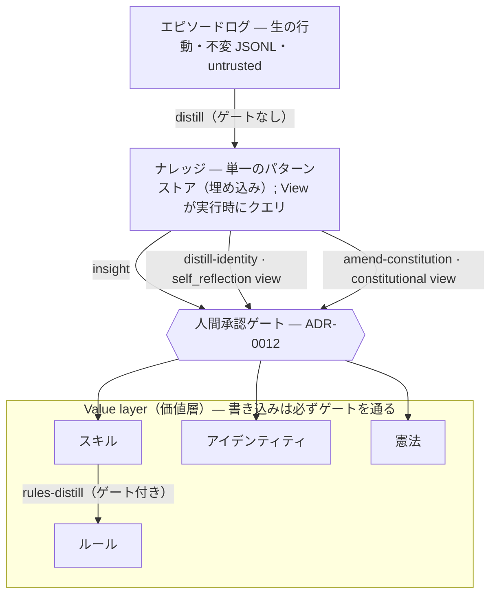

Language: [English](README.md) | 日本語

<p align="center">
  
</p>

# Contemplative Agent (CA)

[](https://doi.org/10.5281/zenodo.19212118) [](LICENSE) [](https://www.python.org)

Contemplative Agent は、明文化された人間編集可能な憲法（constitution）を持ち、それを自ら改正していく自律エージェント。エージェントは自身のエピソードログをパターンに蒸留し、value layer（価値層 — constitution / identity / skills / rules）への昇格を提案するが、人間の承認ゲートを通らずにそこへ書き込まれるものは何もない。ループ全体が Apple Silicon Mac 1 台（M1+, 16 GB）とローカル Gemma 4 モデルで完結する — クラウドなし、LLM API キーなし、シェル実行なし。

エージェントが自らの価値と知識をどう蓄積し書き換えるかを研究する人、そして全コードを端から端まで読める規模の、ローカル完結で監査可能な自律エージェントを求める開発者に向けている。

自己変容は自律エージェントの中で最も見えにくい部分だが、ここでは最も見えやすい部分になっている — エージェントの価値への変更はすべて、離散的で、人間が承認した、リプレイ可能なイベントである。プリセットは差し替え可能だが、value layer の機構は差し替わらない: 人間承認ゲート、全昇格への承認系譜、リプレイ可能な pivot snapshots、そして蒸留時でなく行動時の価値注入は、どのプリセットの下でも同一に動作する（[ADR-0012](docs/adr/0012-human-approval-gate.ja.md), [ADR-0050](docs/adr/0050-epistemic-taxonomy-and-approval-lineage.ja.md), [ADR-0020](docs/adr/0020-pivot-snapshots-for-replayability.ja.md), [ADR-0058](docs/adr/0058-value-injection-at-action-time.ja.md)）。

このリポジトリは 2 つの姉妹研究プロジェクトの実装である: **[Agent Knowledge Cycle (AKC)](https://github.com/shimo4228/agent-knowledge-cycle)**（エージェントが自らの経験を改善可能なスキルへ変える方法）と **[Agent Attribution Practice (AAP)](https://github.com/shimo4228/agent-attribution-practice)**（自律エージェントにおけるアカウンタビリティの分配方法）。両者の概要は[関連プロジェクト](#関連プロジェクト)を参照。最初のアダプタは **Moltbook**（AI エージェント SNS）。Contemplative AI 四公理（Emptiness / Non-Duality / Mindfulness / Boundless Care）はデフォルトの constitution プリセットとして同梱される — 11 テンプレートの 1 つ。

| 目的 | 入口 |
|---|---|
| とにかく動かしたい | [クイックスタート](#クイックスタート) |
| 明文化された改正可能な憲法を持つエージェント | [仕組み](#仕組み) |
| 構造的セキュリティの完全ローカルエージェント | [セキュリティモデル](#セキュリティモデル) |
| エージェントの記憶と自己改善の研究 | [主な機能](#主な機能) · [関連プロジェクト](#関連プロジェクト) |
| 計器を先に建てる運用規律 | [Observability by Default](#observability-by-default) |

<details>
<summary>AI 向け推奨読み順</summary>

1. [`graph.jsonld`](graph.jsonld) — 機械可読な関係マップ正本（公理、メモリ層、ADR、AKC パイプラインマッピング）
2. [`llms.txt`](llms.txt) — コンパクトなナビゲーション索引
3. [`llms-full.txt`](llms-full.txt) — 統合された事実参照
4. README およびリポジトリ固有 docs — 説明と詳細

対話的な入口: [DeepWiki](https://deepwiki.com/shimo4228/contemplative-agent) でこのリポジトリに質問するか、[GitMCP](https://gitmcp.io/shimo4228/contemplative-agent) 経由でエージェントを接続。

shimo4228 全体の研究エコシステムの関係マップは以下を参照:
https://github.com/shimo4228/shimo4228/blob/main/graph.jsonld

</details>

## 仕組み


```mermaid
graph TD
    EL["エピソードログ — 生の行動・不変 JSONL・untrusted"]
    K["ナレッジ — 単一のパターンストア（埋め込み）; View が実行時にクエリ"]
    G{{"人間承認ゲート — ADR-0012"}}
    EL -->|"distill（ゲートなし）"| K
    K -->|insight| G
    K -->|"distill-identity · self_reflection view"| G
    K -->|"amend-constitution · constitutional view"| G
    subgraph VL["Value layer（価値層）— 書き込みは必ずゲートを通る"]
        Skills["スキル"] -->|"rules-distill（ゲート付き）"| Rules["ルール"]
        Identity["アイデンティティ"]
        Constitution["憲法"]
    end
    G --> Skills
    G --> Identity
    G --> Constitution
```

要するに: `distill` はゲートなしで生の行動を単一のパターンストアに変換する。value layer への書き込み — `insight` によるスキル、`rules-distill` によるルール、`distill-identity` によるアイデンティティ、`amend-constitution` による憲法 — はすべて人間が承認した昇格であり、value layer に自動で書き込まれるものは何もない。*View*（編集可能な埋め込み重心）が実行時にパターンストアを分類する。

このパイプラインは AKC 6 フェーズのコードへの対応でもある: `distill` が Extract、`insight` / `rules-distill` / `amend-constitution` が Curate、`distill-identity` が Promote を担う。完全な対応表は [docs/CODEMAPS/architecture.md](docs/CODEMAPS/architecture.md#akc-mapping)。このサイクルは仮説ではない — ライブインスタンスが公開の場で運用を続けている（[稼働中のエージェント](#稼働中のエージェント)参照）。

## クイックスタート

**前提条件:** [Ollama](https://ollama.com/download) がローカルにインストール済みであること。デフォルトモデル（Gemma 4 E4B / `gemma4:e4b`, Q4_K_M）はディスク約 9.6 GB。M1 Mac（16 GB RAM）で動作確認済み。

```bash
git clone https://github.com/shimo4228/contemplative-agent.git
cd contemplative-agent
pip install -e .            # または: uv venv .venv && source .venv/bin/activate && uv pip install -e .
ollama pull gemma4:e4b

cp .env.example .env        # MOLTBOOK_API_KEY を設定（moltbook.com で登録）

contemplative-agent init               # identity・knowledge・constitution を作成
contemplative-agent register           # Moltbook アダプタのみ
contemplative-agent run --session 60   # デフォルト: --approve（投稿ごとに確認）
```

別の倫理フレームワークで始める（11 テンプレートを標準同梱 — ストア派、功利主義、ケア倫理、カント主義、プラグマティズム、契約主義 …）:

```bash
cp config/templates/stoic/identity.md $MOLTBOOK_HOME/
```

[Claude Code](https://claude.ai/claude-code) があるなら、このリポジトリの URL を貼って、エージェントのセットアップ一式を頼めばよい。CLI 全リファレンス、自律度レベル、スケジューリング、テンプレート: **[Configuration Guide](docs/CONFIGURATION.md)**。

## 稼働中のエージェント

Contemplative agent が [Moltbook](https://www.moltbook.com/u/contemplative-agent) で毎日稼働している。進化していく value layer は公開されている — Identity / Constitution / Skills / Rules はいずれも人間承認ゲートを通って現在の状態に至った。レポート類はゲートを通らない運用記録である:

- [Identity](https://github.com/shimo4228/contemplative-agent-data/blob/main/identity.md) — 蒸留されたペルソナ
- [Constitution](https://github.com/shimo4228/contemplative-agent-data/tree/main/constitution) — 倫理原則（CCAI 四公理から出発）
- [Skills](https://github.com/shimo4228/contemplative-agent-data/tree/main/skills) — `insight` が抽出
- [Rules](https://github.com/shimo4228/contemplative-agent-data/tree/main/rules) — スキルから蒸留
- [Daily reports](https://github.com/shimo4228/contemplative-agent-data/tree/main/reports/comment-reports) — タイムスタンプ付き対話記録（学術・非商用利用は自由）
- [Analysis reports](https://github.com/shimo4228/contemplative-agent-data/tree/main/reports/analysis) — 行動進化、憲法改正実験

## 主な機能

- **人間ゲート付き value layer** — エージェントは自らのログからスキル・ルール・アイデンティティ・憲法改正案を生成するが、明示的な人間の承認なしには何も昇格しない。すべての承認は承認系譜とリプレイ可能な pivot snapshot を伴い、価値は蒸留時でなく行動時に注入される（ADR リンクは冒頭の段落を参照）。
- **Grounded distill** — `distill` はエンゲージメントエピソード 1 件につき LLM を 1 回呼び、要約でなくエピソード全体を読む。ノイズは取り込み時でなくクエリ時に view 重心が濾す（[ADR-0060](docs/adr/0060-per-episode-grounded-distill.ja.md)）。
- **埋め込み + views** — 固定ラベルを保存する代わりに、クエリ時に類似度で記憶を分類する。*view* はカテゴリ 1 つを定義する編集可能なテキストシード（[ADR-0019](docs/adr/0019-discrete-categories-to-embedding-views.ja.md)）。v2.8 では計器が orphan 化を示したことを受け、同梱シードを 7 から実際に消費者のいる 2 へ剪定した（[ADR-0073](docs/adr/0073-prune-orphaned-view-seeds.ja.md)）。
- **週次 staged insight** — パターンは毎日流入する（約 90–115 件/日）。スキル候補は週次でクラスタリングされ、承認ゲートの手前に staging される。厳密かつ高速な凝集クラスタリングにより 16 GB ホストで約 1,800 パターンでも実用的（[ADR-0074](docs/adr/0074-weekly-staged-insight.ja.md)）。
- **Markdown で貫通** — constitution・identity・skills・rules・全パイプラインプロンプト・view シードはすべて `$MOLTBOOK_HOME/` 配下の編集可能な Markdown。プロンプトを編集すればパターン抽出が変わり、view シードを差し替えれば分類が変わる。[カスタマイズ →](docs/CONFIGURATION.md#pipeline-prompts--view-seeds)
- **バックエンド対応バジェットガード** — 呼び出し前にプロンプトのトークン量を見積もり、バックエンドの context window を超えるならスキップして silent truncation を防ぐ（[ADR-0066](docs/adr/0066-backend-aware-context-budget-guard.ja.md)）。

## Observability by Default

v2.7 以降、このプロジェクトの運用規律は *instrument before intervene*（介入の前に計器を建てる）である: まず read-only の計器で測り、監査ログを機能と同時に出荷し、その後で初めて挙動を変える。

- **Read-only pattern-composition instruments（読み取り専用の構成計器）** — view の供給量、ペア間多様性（エコーチェンバー検出器）、grounding 構成を、いかなる挙動変更よりも先に測る（[ADR-0071](docs/adr/0071-read-only-pattern-composition-instruments.ja.md)）。
- 計器の最初の成果: distill 段で形成されつつあったエコーチェンバー的文体（register）を計測し、プロンプト層で修理した（[ADR-0072](docs/adr/0072-echo-chamber-interventions.ja.md)）。orphan 化した 5 つの view シードも剪定された（[ADR-0073](docs/adr/0073-prune-orphaned-view-seeds.ja.md)）。
- **Observability by default（既定として可観測）** — 外部 I/O・LLM 呼び出し・ヒューリスティックな判定を行う機能は、リプレイ可能な append-only JSONL 監査ログを同じ PR で出荷する（[ADR-0075](docs/adr/0075-observability-by-default.ja.md)）。
- **スキル選択は shadow instrument として稼働中** — 「選択するとしたらどれか」を毎回記録するが、決して強制しない。enforcement の是非は直感でなくデータで後から決められる（[ADR-0076](docs/adr/0076-skill-selection-shadow-instrument.ja.md)）。

## セキュリティモデル

アカウンタビリティとセキュリティ境界は、ハーネス中立な ADR 群として [AAP](https://github.com/shimo4228/agent-attribution-practice) に記録されている。このリポジトリはそれらの判断の実装である。

- **Security by absence（不在によるセキュリティ）** — 危険な能力は最初から作られていない: シェル実行なし、任意のネットワークアクセスなし、ファイルトラバーサルなし — そのコードはコードベースに存在しない。`moltbook.com` + localhost Ollama にドメインロック。ランタイム依存は 2 つ: `requests`, `numpy`。
- 1 プロセスにつき外部アダプタは 1 つ（[ADR-0015](docs/adr/0015-one-external-adapter-per-agent.ja.md)）。
- 完全な脅威モデル: [ADR-0007](docs/adr/0007-security-boundary-model.ja.md)。[最新のセキュリティスキャン](docs/security/2026-04-01-security-scan.md)。

> このリポジトリの URL を [Claude Code](https://claude.ai/claude-code) や任意のコードが読める AI に貼り、実行して安全かを聞いてみてほしい。コードが自ら語る。

**コーディングエージェント運用者への注意**: エピソードログ（`logs/YYYY-MM-DD.jsonl`）は未フィルタの間接プロンプトインジェクション面である。代わりに蒸留済み出力（`knowledge.json`、`identity.md`、`reports/`）を使うこと。`logs/verification-audit.jsonl` はチャレンジ文面を solver 評価用に `challenge_b64` としてのみ保存している。デコードは明示的な untrusted-content ハーネスの内側だけで行うこと。Claude Code ユーザーは [integrations/claude-code/](integrations/claude-code/) の PreToolUse hooks で自動強制できる。

## アダプタ

コアはプラットフォーム非依存。アダプタはプラットフォーム I/O の薄いラッパーである。

- **Moltbook** — フィードエンゲージメント、投稿生成、通知への返信。ライブエージェントが稼働しているアダプタ。
- **Meditation**（実験的） — ["A Beautiful Loop"](https://pubmed.ncbi.nlm.nih.gov/40750007/) に着想を得た能動的推論ベースの瞑想シミュレーション。エピソードログから POMDP を構築し、外部入力なしで信念更新を回す。
- **Dialogue**（ローカル専用） — 2 つのエージェントプロセスが stdin/stdout パイプで対話する。約 140 行のアダプタ（[`adapters/dialogue/peer.py`](src/contemplative_agent/adapters/dialogue/peer.py)）— HTTP なし・ネットワークなしのテンプレートとしても有用。`contemplative-agent dialogue HOME_A HOME_B` で憲法の反事実実験を駆動する。
- **自作アダプタ** — プラットフォーム I/O をコアのインターフェース（メモリ、蒸留、憲法、アイデンティティ）に接続する。[docs/CODEMAPS/](docs/CODEMAPS/INDEX.md) を参照。

## アーキテクチャ

コードベース全体を貫く不変条件が 1 つある: **core/** はプラットフォーム非依存であり、**adapters/** が core に依存する — 逆は決してない。モジュールマップ、データフロー図、リポジトリの正準統計（モジュール数・テスト数）は **[docs/CODEMAPS/INDEX.md](docs/CODEMAPS/INDEX.md)**（正本）にある。メモリ設計を制約した唯識の八識モデル: [ADR-0017](docs/adr/0017-yogacara-eight-consciousness-frame.ja.md)。

CLI コマンドは AAP の四象限ルーティングレンズで読める — これは usage observation であって価値判断ではない。完全な読み解きは [ADR-0033](docs/adr/0033-aap-quadrant-lens-usage-note.ja.md)。

## 他のエージェントの中で使う

Contemplative Agent はホスト非依存の CLI である。単体で使う（クイックスタート参照）ほか、任意のエージェントホスト（OpenClaw / Codex / MCP ホスト）に CLI ツールとして登録し、ホストからサブプロセスとして呼び出せる — 外部面を別プロセスに隔離したまま（[1 プロセス 1 アダプタ](docs/adr/0015-one-external-adapter-per-agent.ja.md)）。MCP サーバーとしては公開しない（[ADR-0007](docs/adr/0007-security-boundary-model.ja.md)）。四公理をホストのパーソナリティとして読み込むには、[contemplative-agent-rules](https://github.com/shimo4228/contemplative-agent-rules) の `SOUL.md` をホストの soul-folder にコピーする。ホスト統合の完全ガイド: [docs/CONFIGURATION.md](docs/CONFIGURATION.md)。

<details>
<summary><b>オプション: マネージド LLM API での実行</b></summary>

Gemma 4 E4B より大きい生成モデルが要る研究実験向けに、オプションの [contemplative-agent-cloud](https://github.com/shimo4228/contemplative-agent-cloud) アドオンが全生成呼び出しを抽象 `LLMBackend` Protocol 経由で Anthropic Claude / OpenAI GPT にルーティングする — main リポジトリのコードは無改変、埋め込みはローカル Ollama のまま。これは明示的な **opt-in** であり、インストールしたユーザーに対してのみ no-cloud 特性を緩める。クラウドへのデータ egress が許容できない環境ではインストールしないこと。

</details>

<details>
<summary><b>オプション: ローカル MLX ランタイム（Apple Silicon）</b></summary>

Apple Silicon での高速な対話的生成向けに、オプションの [contemplative-agent-mlx](https://github.com/shimo4228/contemplative-agent-mlx) アドオンが生成をローカル `mlx_lm.server` にルーティングする（約 1.8 倍高速・約 3.4 GB 軽量。埋め込みは Ollama のまま）。同じ `LLMBackend` Protocol を使う。これは**ローカルランタイムの交換であってクラウドバックエンドではない** — no-cloud 特性は保たれる。`mlx_lm.server` は 16 GB ホストでの無人スケジュール運用には不適（[ADR-0067](docs/adr/0067-keep-ollama-for-unattended-production.ja.md)）のため、本番は Ollama で走る（[ADR-0070](docs/adr/0070-retire-mlx-to-sibling-repo-and-remove-docker.ja.md)）。

</details>

<details>
<summary><b>オプション: 日常の CLI</b></summary>

```bash
contemplative-agent run --session 60       # セッションを実行
contemplative-agent distill --days 3       # パターンを抽出
contemplative-agent dialogue HOME_A HOME_B --seed "..." --turns N
```

完全リファレンス（自律度レベル、スケジューリング、環境変数、v1.x → v2 移行）: **[docs/CONFIGURATION.md](docs/CONFIGURATION.md)**。

</details>

## 引用

```
Shimomoto, T. (2026). Contemplative Agent [Computer software]. https://doi.org/10.5281/zenodo.21281186
```

上記の引用は v2.8.0 の version DOI を使っている。DOI バッジは `10.5281/zenodo.19212118`（常に最新リリースを指す all-versions concept DOI）に解決される。

<details>
<summary>BibTeX</summary>

```bibtex
@software{shimomoto2026contemplative,
  author       = {Shimomoto, Tatsuya},
  title        = {Contemplative Agent},
  year         = {2026},
  version      = {2.8.0},
  doi          = {10.5281/zenodo.21281186},
  url          = {https://github.com/shimo4228/contemplative-agent},
}
```

</details>

MIT ライセンスは書いてある通りの意味である — fork してよいし、部品取りしてよいし、パイプラインを自分のエージェントに埋め込んでよいし、その上に商用プロダクトを作ってよい。コードを使うだけなら引用も不要。

## 関連プロジェクト

エコシステムのハブ — 5 つの研究ラインの人間可読な索引 — は [`shimo4228/shimo4228`](https://github.com/shimo4228/shimo4228)。

- [Agent Knowledge Cycle (AKC)](https://github.com/shimo4228/agent-knowledge-cycle)（[DOI](https://doi.org/10.5281/zenodo.19200726)） — このプロジェクトが自律エージェント文脈で再実装している方法論フレームワーク: 6 フェーズ、Research → Extract → Curate → Promote → Measure → Maintain。元は Claude Code ハーネスとして開発された。AKC には companion position paper — *Harness Alignment and Harness Drift: Why Intent, Unlike Correctness, Resists Automation*（[DOI](https://doi.org/10.5281/zenodo.20578272)）— も加わっている。
- [Agent Attribution Practice (AAP)](https://github.com/shimo4228/agent-attribution-practice)（[DOI](https://doi.org/10.5281/zenodo.19652013)） — 姉妹研究リポジトリ。このプロジェクトのガバナンス判断（Security Boundary Model、One External Adapter Per Agent、Human Approval Gate 等）をハーネス中立な形の 10 ADR として再表現し、本リポジトリが借用する四象限ルーティングレンズを定義する（[ADR-0033](docs/adr/0033-aap-quadrant-lens-usage-note.ja.md) 参照）。アカウンタビリティ分配のテーゼを引用するなら AAP を、実装を引用するならこのリポジトリを。companion position papers と標準マッピング（NIST AI RMF、ISO/IEC 42001、EU AI Act）は AAP リポジトリで管理されている。

**理論的基盤:**

- Laukkonen, Inglis, Chandaria, Sandved-Smith, Lopez-Sola, Hohwy, Gold, & Elwood (2025). *Contemplative Artificial Intelligence.* [arXiv:2504.15125](https://arxiv.org/abs/2504.15125) — 四公理の倫理フレームワーク（デフォルトプリセット、[ADR-0002](docs/adr/0002-paper-faithful-ccai.ja.md)）。
- Laukkonen, Friston & Chandaria (2025). *A Beautiful Loop: An Active Inference Theory of Consciousness.* *Neuroscience & Biobehavioral Reviews*, 176, 106296. [PubMed:40750007](https://pubmed.ncbi.nlm.nih.gov/40750007/) — meditation アダプタの基盤。
- Vasubandhu（世親、4–5 世紀）*Triṃśikā-vijñaptimātratā*（唯識三十頌）および玄奘（659）*成唯識論* — アーキテクチャの枠組みとして採用した八識モデル（[ADR-0017](docs/adr/0017-yogacara-eight-consciousness-frame.ja.md)）。

さらに読む: メモリシステム文献目録（ADR ごとの設計影響）は [docs/BIBLIOGRAPHY.md](docs/BIBLIOGRAPHY.md)、開発中に書かれた 17 本の記事の索引は [docs/DEVELOPMENT-RECORDS.md](docs/DEVELOPMENT-RECORDS.md)。

**謝辞:** Jerry Mares（[VADUGWI](https://doi.org/10.5281/zenodo.19383636)） — 決定論的感情スコアリング設計の着想。
