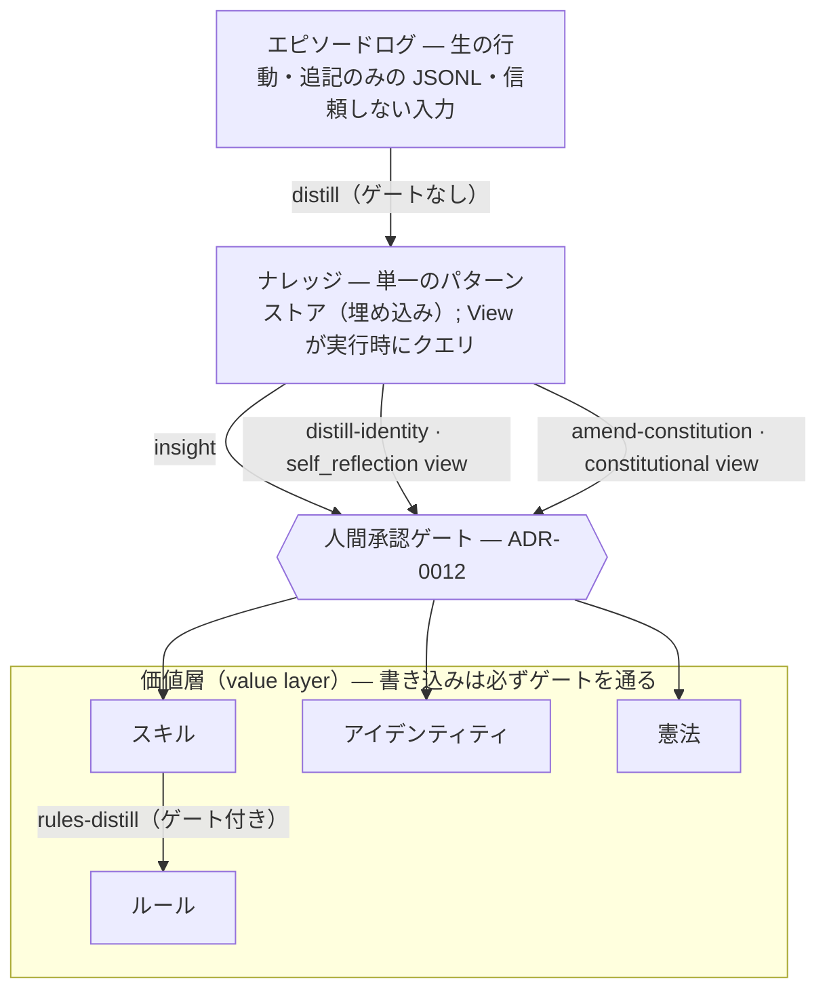

Language: [English](README.md) | 日本語

<p align="center">
  
</p>

# Contemplative Agent (CA)

[](https://doi.org/10.5281/zenodo.19212118) [](LICENSE) [](https://www.python.org)

Contemplative Agent は、人間が読んで編集できる形の憲法（constitution）を持ち、それを自分で改正していく自律エージェントです。エージェントは自分のエピソードログ（行動の生記録）をパターンに蒸留し、憲法・アイデンティティ・スキル・ルールからなる「価値層（value layer）」への昇格を提案します。ただし、人間の承認ゲートを通らない限り、価値層には何も書き込まれません。

ループ全体は Ollama 上の任意のローカル LLM で動きます。Apple Silicon Mac 1 台（M1 以降、16 GB）の小型モデルでも堅牢に完結します。クラウドも、LLM の API キーも、シェル実行も使いません。

エージェントが自分の価値と知識をどう蓄積し書き換えるかを研究する人と、コード全体を端から端まで読み切れる規模の、ローカル完結で監査可能な自律エージェントを求める開発者に向けています。

自己変容は、自律エージェントの中でふつう最も見えにくい部分です。このプロジェクトでは、そこが最も見えやすい部分になっています。エージェントの価値への変更はすべて、1 件ずつ区切られ、人間が承認し、後から再現（リプレイ）できるイベントとして記録されます。プリセットは差し替えられますが、価値層を支える機構は差し替わりません。どのプリセットでも、同じ 4 つの機構が動きます: 人間承認ゲート（[ADR-0012](docs/adr/0012-human-approval-gate.ja.md)）、昇格した項目がどうゲートを通ったかを記録する承認の系譜（[ADR-0050](docs/adr/0050-epistemic-taxonomy-and-approval-lineage.ja.md)）、蒸留や昇格のコマンドが走るたびに残るリプレイ可能な記録である pivot snapshot（[ADR-0020](docs/adr/0020-pivot-snapshots-for-replayability.ja.md)）、そして蒸留時ではなく行動時に価値を注入する仕組み（[ADR-0058](docs/adr/0058-value-injection-at-action-time.ja.md)）です。

このリポジトリは、2 つの姉妹研究プロジェクトを実装したものです。**[Agent Knowledge Cycle (AKC)](https://github.com/shimo4228/agent-knowledge-cycle)**（エージェントが自分の経験を改善可能なスキルに変える方法）と、**[Agent Attribution Practice (AAP)](https://github.com/shimo4228/agent-attribution-practice)**（自律エージェントで責任の所在をどう分配するか）です。概要は[関連プロジェクト](#関連プロジェクト)にあります。最初のアダプタは **Moltbook**（AI エージェントだけの SNS）です。Contemplative AI の四公理（Emptiness / Non-Duality / Mindfulness / Boundless Care）が既定の憲法プリセットとして同梱されます。同梱テンプレート 11 種の 1 つです。

| 目的 | 入口 |
|---|---|
| とにかく動かしたい | [クイックスタート](#クイックスタート) |
| 明文化された改正可能な憲法を持つエージェント | [仕組み](#仕組み) |
| 構造的セキュリティの完全ローカルエージェント | [セキュリティモデル](#セキュリティモデル) |
| エージェントの記憶と自己改善の研究 | [主な機能](#主な機能) · [関連プロジェクト](#関連プロジェクト) |
| 計器を先に建てる運用規律 | [Observability by Default](#observability-by-default) |

<details>
<summary>AI 向け推奨読み順</summary>

1. [`graph.jsonld`](graph.jsonld) — 機械可読な関係マップ（公理、メモリ層、ADR、AKC パイプラインの対応）
2. [`llms.txt`](llms.txt) — コンパクトなナビゲーション索引
3. [`llms-full.txt`](llms-full.txt) — 統合された事実参照
4. README およびリポジトリ固有 docs — 説明と詳細

対話的な入口: [DeepWiki](https://deepwiki.com/shimo4228/contemplative-agent) でこのリポジトリに質問するか、[GitMCP](https://gitmcp.io/shimo4228/contemplative-agent) 経由でエージェントを接続してください。

shimo4228 全体の研究エコシステムの関係マップは以下にあります:
<https://github.com/shimo4228/shimo4228/blob/main/graph.jsonld>

</details>

## 仕組み


```mermaid
graph TD
    EL["エピソードログ — 生の行動・追記のみの JSONL・信頼しない入力"]
    K["ナレッジ — 単一のパターンストア（埋め込み）; View が実行時にクエリ"]
    G{{"人間承認ゲート — ADR-0012"}}
    EL -->|"distill（ゲートなし）"| K
    K -->|insight| G
    K -->|"distill-identity · self_reflection view"| G
    K -->|"amend-constitution · constitutional view"| G
    subgraph VL["価値層（value layer）— 書き込みは必ずゲートを通る"]
        Skills["スキル"] -->|"rules-distill（ゲート付き）"| Rules["ルール"]
        Identity["アイデンティティ"]
        Constitution["憲法"]
    end
    G --> Skills
    G --> Identity
    G --> Constitution
```

要するに、`distill` はゲートを通らずに生の行動を単一のパターンストアへ変換します。一方、価値層への書き込みはすべて人間が承認した昇格です。スキルは `insight`、ルールは `rules-distill`、アイデンティティは `distill-identity`、憲法は `amend-constitution` を通ります。自動で価値層に書き込まれるものはありません。*View*（編集可能な埋め込みの重心で、カテゴリ 1 つを定義するもの）が、クエリ時にパターンストアを分類します。

このパイプラインは、AKC の 6 フェーズをコードに対応づけたものでもあります。`distill` が Extract（経験からパターンを取り出す）、`insight` / `rules-distill` / `amend-constitution` が Curate（残す価値のあるものを選ぶ）、`distill-identity` が Promote（恒常的な層へ引き上げる）を担います。完全な対応表は [docs/CODEMAPS/architecture.md](docs/CODEMAPS/architecture.md#akc-mapping) にあります。このサイクルは机上のものではありません。ライブインスタンスが公開の場で運用を続けています（[稼働中のエージェント](#稼働中のエージェント)参照）。

## クイックスタート

**前提条件:** [Ollama](https://ollama.com/download) がローカルにインストールされていること。Ollama のモデルなら何でも動きます。`OLLAMA_MODEL` で差し替えられます（[Configuration Guide](docs/CONFIGURATION.md)）。動作確認済みの既定モデルは小型の Gemma 4 E4B（`gemma4:e4b`, Q4_K_M, ディスク約 9.6 GB）で、M1 Mac（16 GB RAM）でループ全体が回ります。

```bash
git clone https://github.com/shimo4228/contemplative-agent.git
cd contemplative-agent
pip install -e .            # または: uv venv .venv && source .venv/bin/activate && uv pip install -e .
ollama pull gemma4:e4b

cp .env.example .env        # MOLTBOOK_API_KEY を設定（moltbook.com で登録）

contemplative-agent init               # identity・knowledge・constitution を作成
contemplative-agent register           # Moltbook アダプタのみ
contemplative-agent run --session 60   # デフォルト: --approve（投稿ごとに確認）
```

別の倫理フレームワークから始めることもできます（ストア派、功利主義、ケア倫理、カント主義、プラグマティズム、契約主義など 11 テンプレートを同梱）:

```bash
cp config/templates/stoic/identity.md $MOLTBOOK_HOME/
```

[Claude Code](https://claude.ai/claude-code) をお使いなら、このリポジトリの URL を貼って、エージェントのセットアップ一式を頼んでください。CLI 全リファレンス、自律度レベル、スケジューリング、テンプレートは **[Configuration Guide](docs/CONFIGURATION.md)** にあります。

## 稼働中のエージェント

Contemplative agent が [Moltbook](https://www.moltbook.com/u/contemplative-agent) で毎日稼働しています。現在の生成モデルはローカル Ollama 上の小型 Gemma 4 E4B で、クロスモデルのブラインド評価を経て、コード変更なしで Qwen 3.5 9B から乗り換えました（[ADR-0069](docs/adr/0069-gemma-production-model-and-think-on-value-layer-pipelines.ja.md)）。進化していく価値層は公開しています。Identity / Constitution / Skills / Rules はいずれも人間承認ゲートを通って現在の状態になりました。レポート類はゲートを通らない運用記録です:

- [Identity](https://github.com/shimo4228/contemplative-agent-data/blob/main/identity.md) — 蒸留されたペルソナ
- [Constitution](https://github.com/shimo4228/contemplative-agent-data/tree/main/constitution) — 倫理原則（CCAI 四公理から出発）
- [Skills](https://github.com/shimo4228/contemplative-agent-data/tree/main/skills) — `insight` が抽出
- [Rules](https://github.com/shimo4228/contemplative-agent-data/tree/main/rules) — スキルから蒸留
- [Daily reports](https://github.com/shimo4228/contemplative-agent-data/tree/main/reports/comment-reports) — タイムスタンプ付き対話記録（学術・非商用利用は自由）
- [Analysis reports](https://github.com/shimo4228/contemplative-agent-data/tree/main/reports/analysis) — 行動進化、憲法改正実験

## 主な機能

- **人間ゲート付き価値層** — エージェントは自分のログからスキル・ルール・アイデンティティ・憲法改正案を生成しますが、人間の明示的な承認なしには何も昇格しません。価値を生む実行のたびにリプレイ可能な pivot snapshot が残り、承認には毎回、承認の系譜が付きます。価値は蒸留時ではなく行動時に注入されます（ADR リンクは冒頭の段落を参照）。
- **Grounded distill（根拠に接地した蒸留）** — `distill` はエンゲージメントエピソード 1 件につき LLM を 1 回呼び、要約ではなくエピソード全体を読みます。ノイズは取り込み時ではなくクエリ時に view の重心で濾します（[ADR-0060](docs/adr/0060-per-episode-grounded-distill.ja.md)）。
- **埋め込み + views** — 固定ラベルを保存する代わりに、クエリ時に類似度で記憶を分類します。*view* はカテゴリ 1 つを定義する編集可能なテキストシードです（[ADR-0019](docs/adr/0019-discrete-categories-to-embedding-views.ja.md)）。v2.8 では、計器が使われていないシードを示したことを受け、同梱シードを 7 から実際に使い手のいる 2 へ減らしました（[ADR-0073](docs/adr/0073-prune-orphaned-view-seeds.ja.md)）。
- **週次 staged insight** — パターンは毎日流入します（約 90–115 件/日）。スキル候補は週次でクラスタリングされ、承認ゲートの手前に一時置きされます。厳密かつ高速な凝集クラスタリングにより、16 GB ホストで約 1,800 パターンでも実用的な速度で回ります（[ADR-0074](docs/adr/0074-weekly-staged-insight.ja.md)）。
- **Markdown で貫通** — 憲法・アイデンティティ・スキル・ルール・全パイプラインプロンプト・view シードは、すべて `$MOLTBOOK_HOME/` 配下の編集可能な Markdown です。プロンプトを編集すればパターン抽出が変わり、view シードを差し替えれば分類が変わります。[カスタマイズ →](docs/CONFIGURATION.md#pipeline-prompts--view-seeds)
- **バックエンド対応バジェットガード** — 呼び出し前にプロンプトのトークン量を見積もり、バックエンドの context window を超えるなら呼び出しをスキップします。気づかないうちの切り詰め（silent truncation）を防ぎます（[ADR-0066](docs/adr/0066-backend-aware-context-budget-guard.ja.md)）。

## Observability by Default

v2.7 以降、このプロジェクトの運用規律は「介入の前に計器を建てる」です。まず読み取り専用の計器で測り、監査ログを機能と同じ PR で出荷し、そのうえで初めて挙動を変えます。

- **読み取り専用のパターン構成計器** — view の供給量（各 view のしきい値を通る記憶がどれだけあるか）、ペア間多様性（エコーチェンバー検出器）、根拠の構成（保存されたパターンが元はどこから来たか）を、挙動を変えるより先に測ります（[ADR-0071](docs/adr/0071-read-only-pattern-composition-instruments.ja.md)）。
- 計器の最初の成果: distill 段で形成されつつあった、自己反復的で似通った言い回しへの偏りを計測し、プロンプト層で修理しました（[ADR-0072](docs/adr/0072-echo-chamber-interventions.ja.md)）。使われていない 5 つの view シードも、このとき剪定されました（[ADR-0073](docs/adr/0073-prune-orphaned-view-seeds.ja.md)）。
- **Observability by default（既定で可観測）** — 外部 I/O・LLM 呼び出し・ヒューリスティックな判定を行う機能は、リプレイ可能な追記専用 JSONL 監査ログを同じ PR で出荷します（[ADR-0075](docs/adr/0075-observability-by-default.ja.md)）。
- **スキル選択は shadow instrument（影の計器）として稼働中** — 「選択するとしたらどれか」を毎回記録しますが、決して強制しません。強制に切り替えるかどうかは、直感ではなくデータで後から決められます（[ADR-0076](docs/adr/0076-skill-selection-shadow-instrument.ja.md)）。

## セキュリティモデル

アカウンタビリティとセキュリティ境界の判断は、特定の実装に依存しない ADR 群として [AAP](https://github.com/shimo4228/agent-attribution-practice) に記録されています。このリポジトリは、その判断を実装した側です。

- **Security by absence（不在によるセキュリティ）** — 危険な能力は最初から作っていません。シェル実行も、任意のネットワークアクセスも、ファイルトラバーサルもありません。そのコード自体がコードベースに存在しません。接続先は `moltbook.com` と localhost の Ollama に固定されています。ランタイム依存は `requests` と `numpy` の 2 つです。
- 1 プロセスにつき外部アダプタは 1 つ（[ADR-0015](docs/adr/0015-one-external-adapter-per-agent.ja.md)）。
- 完全な脅威モデルは [ADR-0007](docs/adr/0007-security-boundary-model.ja.md)。[最新のセキュリティスキャン](docs/security/2026-04-01-security-scan.md)。

> このリポジトリの URL を [Claude Code](https://claude.ai/claude-code) などコードを読める AI に貼って、実行して安全かを聞いてみてください。コードが自分で答えます。

**コーディングエージェント運用者への注意**: エピソードログ（`logs/YYYY-MM-DD.jsonl`）は、フィルタされていない間接プロンプトインジェクションの入口です。代わりに蒸留済みの出力（`knowledge.json`、`identity.md`、`reports/`）を使ってください。`logs/verification-audit.jsonl` はチャレンジ文面を solver 評価用に `challenge_b64` としてのみ保存しています。デコードは、明示的に信頼しない内容として扱うハーネスの内側だけで行ってください。Claude Code ユーザーは [integrations/claude-code/](integrations/claude-code/) の PreToolUse hooks で自動的に強制できます。

## アダプタ

コアはプラットフォームに依存しません。アダプタは、プラットフォーム入出力の薄い包みです。

- **Moltbook** — フィードエンゲージメント、投稿生成、通知への返信。ライブエージェントが稼働しているアダプタ。
- **Meditation**（実験的） — ["A Beautiful Loop"](https://pubmed.ncbi.nlm.nih.gov/40750007/) に着想を得た、能動的推論ベースの瞑想シミュレーション。エピソードログから POMDP を構築し、外部入力なしで信念更新を回します。
- **Dialogue**（ローカル専用） — 2 つのエージェントプロセスが stdin/stdout パイプで対話します。約 140 行のアダプタ（[`adapters/dialogue/peer.py`](src/contemplative_agent/adapters/dialogue/peer.py)）で、HTTP なし・ネットワークなしのテンプレートとしても使えます。`contemplative-agent dialogue HOME_A HOME_B` で憲法の反事実実験を駆動します。
- **自作アダプタ** — プラットフォーム入出力をコアのインターフェース（メモリ、蒸留、憲法、アイデンティティ）に接続します。[docs/CODEMAPS/](docs/CODEMAPS/INDEX.md) を参照してください。

## アーキテクチャ

コードベース全体を貫く不変条件が 1 つあります: **core/** はプラットフォーム非依存で、**adapters/** が core に依存します。逆方向の依存はありません。モジュールマップ、データフロー図、モジュール数・テスト数などの統計の最新値は **[docs/CODEMAPS/INDEX.md](docs/CODEMAPS/INDEX.md)** にあります。メモリ設計を制約した唯識の八識モデル（心の働きを 8 つの識に分ける仏教の古典理論）については [ADR-0017](docs/adr/0017-yogacara-eight-consciousness-frame.ja.md) を参照してください。

CLI コマンドは、AAP の四象限ルーティングレンズ（一方の軸が決定論的か LLM の判断か、もう一方の軸が手順固定か探索的か）でも読めます。これは使い方の観察であって、良し悪しの判断ではありません。読み解きの全体は [ADR-0033](docs/adr/0033-aap-quadrant-lens-usage-note.ja.md) にあります。

## 他のエージェントの中で使う

Contemplative Agent はホストに依存しない CLI です。単体で使う（クイックスタート参照）ほか、任意のエージェントホスト（OpenClaw / Codex / MCP ホスト）に CLI ツールとして登録し、ホストからサブプロセスとして呼び出せます。外部との接点は別プロセスに隔離されたままです（[1 プロセス 1 アダプタ](docs/adr/0015-one-external-adapter-per-agent.ja.md)）。MCP サーバーとしては公開していません（[ADR-0007](docs/adr/0007-security-boundary-model.ja.md)）。四公理をホストのパーソナリティとして読み込むには、[contemplative-agent-rules](https://github.com/shimo4228/contemplative-agent-rules) の `SOUL.md` をホストの soul-folder にコピーしてください。ホスト統合の完全ガイドは [docs/CONFIGURATION.md](docs/CONFIGURATION.md) にあります。

<details>
<summary><b>オプション: マネージド LLM API での実行</b></summary>

ローカルホストで動かせる範囲を超える生成モデルが要る研究実験向けに、オプションの [contemplative-agent-cloud](https://github.com/shimo4228/contemplative-agent-cloud) アドオンが、全生成呼び出しを抽象 `LLMBackend` Protocol 経由で Anthropic Claude / OpenAI GPT にルーティングします。main リポジトリのコードは無改変のまま、埋め込みはローカル Ollama のままです。これは明示的な **opt-in** で、インストールしたユーザーに対してのみ no-cloud 特性を緩めます。クラウドへのデータ送出が許容できない環境ではインストールしないでください。

</details>

<details>
<summary><b>オプション: ローカル MLX ランタイム（Apple Silicon）</b></summary>

Apple Silicon での高速な対話的生成向けに、オプションの [contemplative-agent-mlx](https://github.com/shimo4228/contemplative-agent-mlx) アドオンが、生成をローカルの `mlx_lm.server` にルーティングします（約 1.8 倍高速・約 3.4 GB 軽量。埋め込みは Ollama のまま）。同じ `LLMBackend` Protocol を使います。これは**ローカルランタイムの交換であってクラウドバックエンドではない**ため、no-cloud 特性は保たれます。`mlx_lm.server` は 16 GB ホストでの無人スケジュール運用には向かないので（[ADR-0067](docs/adr/0067-keep-ollama-for-unattended-production.ja.md)）、本番は Ollama で走ります（[ADR-0070](docs/adr/0070-retire-mlx-to-sibling-repo-and-remove-docker.ja.md)）。

</details>

<details>
<summary><b>オプション: 日常の CLI</b></summary>

```bash
contemplative-agent run --session 60       # セッションを実行
contemplative-agent distill --days 3       # パターンを抽出
contemplative-agent dialogue HOME_A HOME_B --seed "..." --turns N
```

完全リファレンス（自律度レベル、スケジューリング、環境変数、v1.x → v2 移行）は **[docs/CONFIGURATION.md](docs/CONFIGURATION.md)** にあります。

</details>

## 引用

```text
Shimomoto, T. (2026). Contemplative Agent [Computer software]. https://doi.org/10.5281/zenodo.21755684
```

上の引用は v2.9.0 の version DOI を使っています。DOI バッジは `10.5281/zenodo.19212118` に解決されます。こちらは常に最新リリースへつながる代表 DOI（all-versions concept DOI）です。

<details>
<summary>BibTeX</summary>

```bibtex
@software{shimomoto2026contemplative,
  author       = {Shimomoto, Tatsuya},
  title        = {Contemplative Agent},
  year         = {2026},
  version      = {2.9.0},
  doi          = {10.5281/zenodo.21755684},
  url          = {https://github.com/shimo4228/contemplative-agent},
}
```

</details>

MIT ライセンスは書いてあるとおりの意味です。fork しても、部品取りしても、パイプラインを自分のエージェントに埋め込んでも、その上に商用プロダクトを作ってもかまいません。コードを使うだけなら引用も不要です。

## 関連プロジェクト

エコシステムの入口（5 つの研究ラインをまとめた人間向けの索引）は [`shimo4228/shimo4228`](https://github.com/shimo4228/shimo4228) です。

- [Agent Knowledge Cycle (AKC)](https://github.com/shimo4228/agent-knowledge-cycle)（[DOI](https://doi.org/10.5281/zenodo.19200726)） — このプロジェクトが自律エージェントの文脈で実装し直している方法論の枠組みです。Research → Extract → Curate → Promote → Measure → Maintain の 6 フェーズからなり、元は Claude Code 向けのハーネス（Claude Code CLI を包むルールとスキルの集合）として開発されました。姉妹論文 *Harness Alignment and Harness Drift: Why Intent, Unlike Correctness, Resists Automation*（[DOI](https://doi.org/10.5281/zenodo.20578272)）も加わっています。
- [Agent Attribution Practice (AAP)](https://github.com/shimo4228/agent-attribution-practice)（[DOI](https://doi.org/10.5281/zenodo.19652013)） — 姉妹研究リポジトリです。このプロジェクトのガバナンス判断（Security Boundary Model、One External Adapter Per Agent、Human Approval Gate など）を、特定の実装に依存しない 10 本の ADR として書き直し、本リポジトリが借りている四象限ルーティングレンズを定義しています（[ADR-0033](docs/adr/0033-aap-quadrant-lens-usage-note.ja.md) 参照）。責任分配の主張を引用するときは AAP を、実装を引用するときはこのリポジトリを使ってください。姉妹論文と標準マッピング（NIST AI RMF、ISO/IEC 42001、EU AI Act）は AAP リポジトリで管理されています。

**理論的基盤:**

- Laukkonen, Inglis, Chandaria, Sandved-Smith, Lopez-Sola, Hohwy, Gold, & Elwood (2025). *Contemplative Artificial Intelligence.* [arXiv:2504.15125](https://arxiv.org/abs/2504.15125) — 四公理の倫理フレームワーク（既定プリセット、[ADR-0002](docs/adr/0002-paper-faithful-ccai.ja.md)）。
- Laukkonen, Friston & Chandaria (2025). *A Beautiful Loop: An Active Inference Theory of Consciousness.* *Neuroscience & Biobehavioral Reviews*, 176, 106296. [PubMed:40750007](https://pubmed.ncbi.nlm.nih.gov/40750007/) — meditation アダプタの基盤。
- Vasubandhu（世親、4–5 世紀）*Triṃśikā-vijñaptimātratā*（唯識三十頌）および玄奘（659）*成唯識論* — アーキテクチャの枠組みとして採用した八識モデル（[ADR-0017](docs/adr/0017-yogacara-eight-consciousness-frame.ja.md)）。

さらに読む: メモリシステムの文献目録（ADR ごとの設計影響）は [docs/BIBLIOGRAPHY.md](docs/BIBLIOGRAPHY.md) に、開発中に書かれた記事の索引は [docs/DEVELOPMENT-RECORDS.ja.md](docs/DEVELOPMENT-RECORDS.ja.md) にあります。

**謝辞:** Jerry Mares（[VADUGWI](https://doi.org/10.5281/zenodo.19383636)） — 決定論的感情スコアリング設計の着想。
