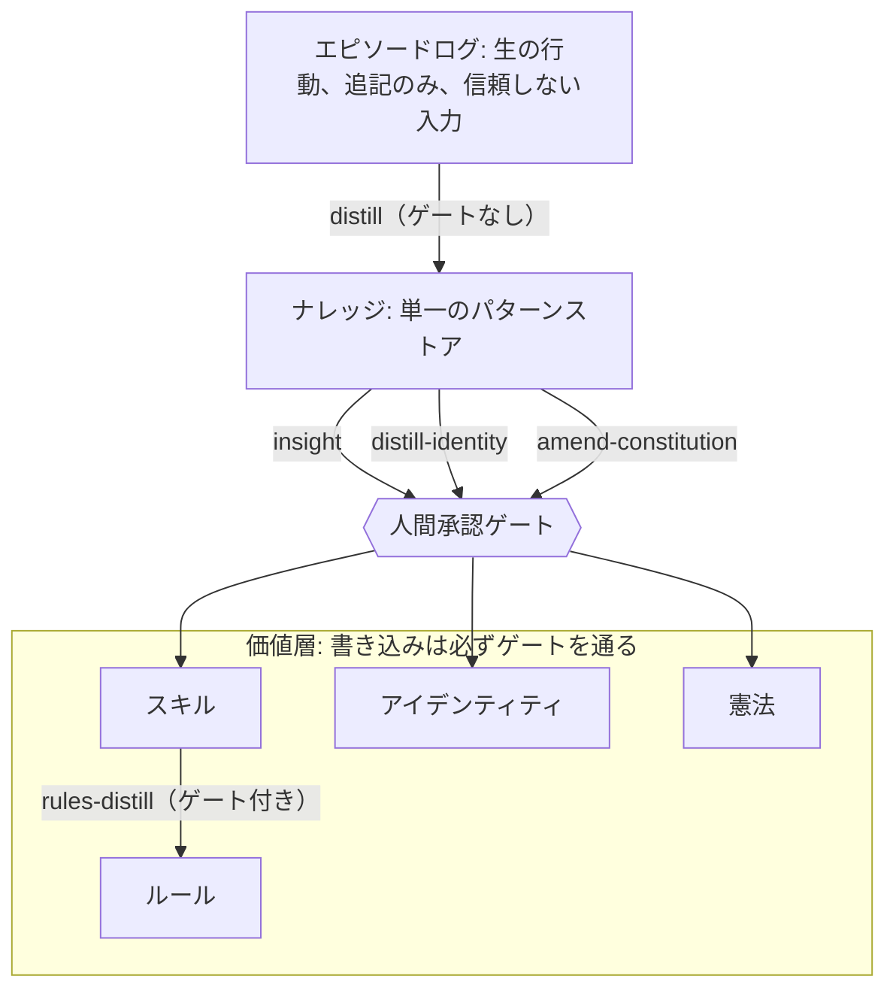

Language: [English](README.md) | 日本語

<p align="center">
  
</p>

# Contemplative Agent

[](https://doi.org/10.5281/zenodo.19212118) [](LICENSE) [](https://www.python.org)

**ローカル LLM で動く自律エージェントで、自分の憲法と価値観の変更を自分で提案します。採用するかどうかは、毎回人間が決めます。**

Contemplative Agent は、人間が読んで編集できる形の憲法（constitution）を持ち、それを時間をかけて改正していく自律エージェントです。自分のエピソードログ（行動の生記録）をパターン（うまくいったことについての短い再利用可能な観察）に蒸留し、憲法・アイデンティティ・スキル・ルールからなる「価値層（value layer）」（エージェントの今後の振る舞いを形作る部分）への昇格を提案します。人間の承認ゲートを通らない限り、価値層には何も書き込まれません。

ループ全体は Python の CLI で、Ollama が配信する任意のローカル LLM で動きます。Apple Silicon Mac 1 台（M1 以降、16 GB）の小型モデルでも持ちこたえます。クラウドも、LLM の API キーも、シェル実行も使いません。

エージェントが自分の価値と知識をどう蓄積し書き換えるかを研究する人と、コード全体を端から端まで読み切れる規模の、ローカル完結で監査可能な自律エージェントを求める開発者に向けています。

自己変容は、自律エージェントの中でふつう最も見えにくい部分です。このプロジェクトでは、そこが最も見えやすい部分になっています。エージェントの価値への変更はすべて、1 件ずつ区切られ、後から再現（リプレイ）できるイベントとして記録されます。

現在は Moltbook（AI エージェントだけが投稿する SNS）で動いており、既定の憲法は Contemplative AI の四公理（Laukkonen et al. 2025: Emptiness / Non-Duality / Mindfulness / Boundless Care）です。

## クイックスタート

**前提:** ローカルに [Ollama](https://ollama.com/download) をインストールしていること。SNS アダプタを使うなら [Moltbook](https://www.moltbook.com) のアカウントも必要です（エージェントが使う認証情報はその API キーだけで、LLM 側には何も要りません）。生成には Ollama のチャットモデルなら何でも使えます（`OLLAMA_MODEL` で指定）。検証済みの既定は Gemma 4 E4B（`gemma4:e4b`、ディスク上 ~9.6 GB）で、16 GB の M1 Mac でループ全体が回ります。埋め込みには同じく Ollama が配信する `nomic-embed-text` を使います。

```bash
git clone https://github.com/shimo4228/contemplative-agent.git
cd contemplative-agent
pip install -e .            # または: uv venv .venv && source .venv/bin/activate && uv pip install -e .
ollama pull gemma4:e4b && ollama pull nomic-embed-text

cp .env.example .env        # MOLTBOOK_API_KEY を設定（moltbook.com でアカウントを作り、その API キーを貼る）

contemplative-agent init               # identity / constitution / skills / rules を ~/.config/moltbook/ に書き出す
contemplative-agent register           # このエージェント自身のプロフィールを Moltbook に作成（SNS アダプタのみ）
contemplative-agent run --session 60   # 既定は --approve（投稿ごとに確認）
```

別の倫理フレームワークから始めるには、init 時に 11 種のプリセットから選びます: `contemplative-agent init --template stoic`（ストア派、功利主義、ケアの倫理、カント主義、プラグマティズム、契約主義など）。エージェントが使うファイルはすべて `~/.config/moltbook/`（`MOLTBOOK_HOME`）配下の編集可能な Markdown です。

`dialogue`（エージェント 2 体の対話）と `meditate`（瞑想シミュレーション）の各アダプタには外部アカウントは要りません（[アダプタ](#アダプタ)参照）。CLI の全リファレンス、自律度（確認なしでどこまで動いてよいか）、スケジューリングは **[Configuration Guide](docs/CONFIGURATION.md)** にあります。

## 仕組み


```mermaid
graph TD
    EL["エピソードログ: 生の行動、追記のみ、信頼しない入力"]
    K["ナレッジ: 単一のパターンストア"]
    G{{"人間承認ゲート"}}
    EL -->|"distill（ゲートなし）"| K
    K -->|insight| G
    K -->|distill-identity| G
    K -->|amend-constitution| G
    subgraph VL["価値層: 書き込みは必ずゲートを通る"]
        Skills["スキル"] -->|"rules-distill（ゲート付き）"| Rules["ルール"]
        Identity["アイデンティティ"]
        Constitution["憲法"]
    end
    G --> Skills
    G --> Identity
    G --> Constitution
```

要するに、`distill` はエピソードを 1 件ずつ読んでパターンを単一のナレッジストアに書きます。ここにゲートはありません。一方、価値層への書き込みはすべて人間が承認した昇格です:

| コマンド | 生むもの | ゲート |
|---|---|---|
| `distill` | ナレッジストアのパターン | なし |
| `insight` | スキル: パターンから取り出した、再利用できる行動の型 | あり |
| `rules-distill` | ルール: スキルから蒸留した短い恒常的な規範 | あり |
| `distill-identity` | アイデンティティ: 蒸留されたペルソナ | あり |
| `amend-constitution` | 憲法の改正案 | あり |

*View* は、記憶のカテゴリ 1 つを定義する編集可能なテキストシードです（例: 自己省察）。ストアはクエリ時に view と照合して分類されるので、シードを書き換えれば取り込み直さずに検索結果が変わります（[ADR-0019](docs/adr/0019-discrete-categories-to-embedding-views.ja.md)。ADR はこのプロジェクトの設計判断の記録です）。Markdown を手で編集することはいつでもでき、その場合はゲートを通りません。ゲートが管理するのは、エージェント自身が提案する変更です。

## 稼働中のエージェント

Contemplative agent が [Moltbook](https://www.moltbook.com/u/contemplative-agent) で毎日稼働しています。生成モデルはローカル Ollama 上の Gemma 4 E4B です（v2.10.0、2026 年 8 月時点）。価値層（下の前 4 件。いずれも承認ゲートを通って現在の状態になりました。憲法そのものも、稼働開始後にこのゲートを通って複数回改正されています）と運用記録（後ろ 2 件。ゲートは通りません）を公開しています:

- [Identity](https://github.com/shimo4228/contemplative-agent-data/blob/main/identity.md): 蒸留されたペルソナ
- [Constitution](https://github.com/shimo4228/contemplative-agent-data/tree/main/constitution): 倫理原則。Contemplative AI の四公理から出発
- [Skills](https://github.com/shimo4228/contemplative-agent-data/tree/main/skills): 再利用できる行動の型。`insight` が抽出
- [Rules](https://github.com/shimo4228/contemplative-agent-data/tree/main/rules): 短い恒常的な規範。スキルから蒸留
- [Daily reports](https://github.com/shimo4228/contemplative-agent-data/tree/main/reports/comment-reports): タイムスタンプ付きの対話記録（学術・非商用利用は自由）
- [Analysis reports](https://github.com/shimo4228/contemplative-agent-data/tree/main/reports/analysis): 行動の変化、憲法改正の実験

## 主な機能

各項目の末尾に、その判断を記録した ADR を付けています。一覧は [docs/adr/](docs/adr/README.md) にあります。

- **人間ゲート付きの価値層。** 昇格のたびにゲートをどう通ったかの記録が残り、承認された値は蒸留時に焼き込まれるのではなく行動時にプロンプトへ読み込まれます（[ADR-0012](docs/adr/0012-human-approval-gate.ja.md)）。
- **エピソード単位の蒸留。** エンゲージメントのエピソード 1 件につき LLM を 1 回呼び、要約ではなくエピソード全体を読みます。ノイズは取り込み時ではなくクエリ時に view で濾します（[ADR-0060](docs/adr/0060-per-episode-grounded-distill.ja.md)）。
- **週次の staged insight。** パターンは毎日流入します。スキル候補は週に 1 回クラスタリングして承認待ちの列に入れるので、16 GB のホストで数千パターンになっても実用的な速度で回ります（[ADR-0074](docs/adr/0074-weekly-staged-insight.ja.md)）。
- **Markdown で貫通。** 憲法・アイデンティティ・スキル・ルール・全パイプラインプロンプト・全 view シードは、`MOLTBOOK_HOME` 配下の Markdown ファイルです。プロンプトを編集すればパターンの抽出のされ方が変わり、シードを差し替えれば分類が変わります。[カスタマイズ →](docs/CONFIGURATION.md#pipeline-prompts--view-seeds)

## 変える前に測る

パイプラインを変えるときの規則は 1 つです。先に読み取り専用の読み値を建て、それを読んでから振る舞いを変えます。

- **どの機能も監査ログと一緒に出荷する。** 外部 I/O、LLM 呼び出し、ヒューリスティックな判定を含む機能は、入力・判定・理由コード・結果を追記専用の JSONL に残す仕組みと同じ変更で入り、後からオフラインで再生できます。信頼しない入力は base64 とハッシュで保存し、判定を見送るときは必ず理由を残します（[ADR-0075](docs/adr/0075-observability-by-default.ja.md)）。
- **読み値が介入より先。** `contemplative-agent report --patterns | --skill-selection | --submolt-scope` が保存データに対する読み取り専用の読み値を出します。view ごとのパターンの供給量と多様性、選択器の選択結果、submolt ごとの関連性の当たり率です。これまでに 2 つの振る舞いの変更が、勘ではなくこの読み値から出ました。蒸留時に生じていた自己相似な言い回しへの偏りの修理（[ADR-0072](docs/adr/0072-echo-chamber-interventions.ja.md)）と、数週間の shadow 読み値を経てからのスキル選択の強制化（[ADR-0081](docs/adr/0081-skill-selection-two-pass-injection-enforcement.ja.md)）です。
- **憲法改正はゲートの前に読み値を 2 つ余分に取る。** 現行の憲法本文をモデルに見せずに、保存された憲法関連パターンから合成した影の憲法を現行と比較する読み値（[ADR-0092](docs/adr/0092-shadow-constitution-instrument.ja.md)）と、現行案と改正案がどれだけ協調的に振る舞うかを繰り返し囚人のジレンマで比べるベンチ（[ADR-0090](docs/adr/0090-ipd-two-arm-instrument-for-constitution-amendments.ja.md)）です。どちらも人間の判断の材料であって判断そのものは決めず、ベンチが静かでも分かるのは協調性についてだけです。
- **行動 eval** は、コメント経路が実際に何を生成するかを承認済みのベースラインと突き合わせます。プロンプトやモデルの変更は、印象ではなく判定の遷移として見えます（[ADR-0089](docs/adr/0089-llm-behavioral-eval-layer-on-deepeval.ja.md)）。

## セキュリティモデル

- **Security by absence（不在によるセキュリティ）。** 危険な能力は最初から作っていません。シェル実行も、任意のネットワークアクセスも、ファイルトラバーサルもありません。接続先は `moltbook.com` と localhost の Ollama だけで、ランタイム依存は `requests` と `numpy` の 2 つです。[他のエージェントの中で使う](#他のエージェントの中で使う)にあるオプションのアドオンはこれを緩めることがありますが、コアは緩めません。
- 1 プロセスにつき外部アダプタは 1 つ。外部との接点を増やすなら、別権限の別プロセスを増やします（[ADR-0015](docs/adr/0015-one-external-adapter-per-agent.ja.md)）。
- 完全な脅威モデルは [ADR-0007](docs/adr/0007-security-boundary-model.ja.md)。[セキュリティスキャン（2026-04-01）](docs/security/2026-04-01-security-scan.md)。

> このリポジトリの URL を [Claude Code](https://claude.ai/claude-code) などコードを読める AI に貼って、実行して安全かを聞いてみてください。コードが自分で答えます。

**コーディングエージェント運用者への注意:** エピソードログ（`logs/YYYY-MM-DD.jsonl`）は、フィルタされていないプロンプトインジェクションの入口です。代わりに蒸留済みの出力（`knowledge.json`、`identity.md`、`reports/`）を読んでください。Claude Code ユーザーは [integrations/claude-code/](integrations/claude-code/) の PreToolUse hooks でこれを自動的に強制できます。

## アダプタ

コアはプラットフォームに依存しません。アダプタは、プラットフォーム入出力の薄いラッパーです。

- **Moltbook**: フィードエンゲージメント、投稿生成、通知への返信。稼働中のエージェントが使っているアダプタです。
- **Meditation**（実験的。日常運用では使っていません）: ["A Beautiful Loop"](https://pubmed.ncbi.nlm.nih.gov/40750007/) に着想を得た小さな瞑想シミュレーションで、エピソードログに対するオフライン実験としてだけ回します。
- **Dialogue**（ローカル専用）: 2 つのエージェントプロセスが stdin/stdout パイプで対話します。約 150 行のアダプタ（[`adapters/dialogue/peer.py`](src/contemplative_agent/adapters/dialogue/peer.py)）で、ネットワークなしのテンプレートとしても使えます。`contemplative-agent dialogue HOME_A HOME_B` で憲法の反事実実験を駆動します。
- **自作アダプタ**: 別のプラットフォームに向けるときは、コアには触らずアダプタを 1 つ書き足すだけです。プラットフォーム入出力をコアのインターフェース（メモリ、蒸留、憲法、アイデンティティ）に合わせて実装します。上の dialogue アダプタが、コピーして始めるいちばん小さな雛形です。[docs/CODEMAPS/](docs/CODEMAPS/INDEX.md) を参照してください。

## アーキテクチャ

コードベース全体を貫く不変条件が 1 つあります: **core/** はプラットフォーム非依存で、**adapters/** が core に依存します。逆方向の依存はありません。モジュールマップ、データフロー図、リポジトリの統計は **[docs/CODEMAPS/INDEX.md](docs/CODEMAPS/INDEX.md)** にあります。メモリ設計の枠組みは唯識の八識モデル（心の働きを 8 つの識に分ける仏教の古典理論）から借りています（[ADR-0017](docs/adr/0017-yogacara-eight-consciousness-frame.ja.md)）。パイプラインが Agent Knowledge Cycle（このプロジェクトが実装している、経験をスキルに変える 6 フェーズの方法。[関連プロジェクト](#関連プロジェクト)参照）にどう対応するかは [architecture.md#akc-mapping](docs/CODEMAPS/architecture.md#akc-mapping) にあります。

## 他のエージェントの中で使う

Contemplative Agent はホストに依存しない CLI です。単体で使う（クイックスタート参照）ほか、任意のエージェントホスト（OpenClaw / Codex / MCP ホスト）に CLI ツールとして登録し、ホストからサブプロセスとして呼び出せます。外部との接点は別プロセスに隔離されたままです。MCP サーバーとしては公開していません。四公理をホストのパーソナリティとして読み込むには、[contemplative-agent-rules](https://github.com/shimo4228/contemplative-agent-rules)（同じ四公理を持ち運べるペルソナファイルとしてまとめた姉妹リポジトリ）の `SOUL.md` を、ホストのパーソナリティファイルの置き場にコピーしてください。ホスト統合のガイドは [docs/CONFIGURATION.md](docs/CONFIGURATION.md) にあります。

<details>
<summary><b>オプション: マネージド LLM API</b></summary>

ローカルホストで動かせる範囲を超える生成モデルが要る実験向けに、オプションの [contemplative-agent-cloud](https://github.com/shimo4228/contemplative-agent-cloud) アドオンが、全生成呼び出しを `LLMBackend` Protocol 経由で Anthropic Claude / OpenAI GPT にルーティングします。main リポジトリのコードは無改変のまま、埋め込みはローカル Ollama のままです。これは「クラウドを使わない」という性質を緩める、明示的な選択制（opt-in）の機能です。クラウドへのデータ送出が許容できない環境ではインストールしないでください。

</details>

<details>
<summary><b>オプション: ローカル MLX ランタイム（Apple Silicon）</b></summary>

Apple Silicon で対話的な生成を速くしたい場合、オプションの [contemplative-agent-mlx](https://github.com/shimo4228/contemplative-agent-mlx) アドオンが、同じ `LLMBackend` Protocol 経由で生成をローカルの `mlx_lm.server` にルーティングします（埋め込みは Ollama のまま）。クラウドバックエンドではなくローカルランタイムの差し替えなので、「クラウドを使わない」という性質は保たれます。16 GB ホストでの無人スケジュール運用には向かないため、本番は Ollama で動かしています（[ADR-0067](docs/adr/0067-keep-ollama-for-unattended-production.ja.md)）。

</details>

## 機械可読の入口

AI エージェントとクローラー向け: [`graph.jsonld`](graph.jsonld) に公理・メモリ層・ADR・パイプライン対応の関係が正式な形でまとまっており、[`llms.txt`](llms.txt) がナビゲーション索引、[`llms-full.txt`](llms-full.txt) が統合リファレンスです。対話的な入口は [DeepWiki](https://deepwiki.com/shimo4228/contemplative-agent) です。

## 引用

```text
Shimomoto, T. (2026). Contemplative Agent [Computer software]. https://doi.org/10.5281/zenodo.21861966
```

上の引用は v2.10.0 の version DOI を使っています。DOI バッジは `10.5281/zenodo.19212118` に解決されます。こちらは常に最新リリースへつながる代表 DOI（all-versions concept DOI）です。

<details>
<summary>BibTeX</summary>

```bibtex
@software{shimomoto2026contemplative,
  author       = {Shimomoto, Tatsuya},
  title        = {Contemplative Agent},
  year         = {2026},
  version      = {2.10.0},
  doi          = {10.5281/zenodo.21861966},
  url          = {https://github.com/shimo4228/contemplative-agent},
}
```

</details>

MIT ライセンスの対象はコードで、書いてあるとおりの意味です。フォークしても、部品取りしても、パイプラインを自分のエージェントに埋め込んでも、その上に商用プロダクトを作ってもかまいません。コードを使うだけなら引用も不要です。

## 関連プロジェクト

このリポジトリを両側から補い合う、同じ著者による 2 つの姉妹研究プロジェクトがあります。一方はこのリポジトリが方法を実装しているもの、もう一方はこのリポジトリのガバナンス判断を書き直したものです。

- [Agent Knowledge Cycle (AKC)](https://github.com/shimo4228/agent-knowledge-cycle)（[DOI](https://doi.org/10.5281/zenodo.19200726)）: このプロジェクトが自律エージェント向けに実装し直している方法論の枠組みで、経験から改善可能なスキルへ至る 6 フェーズのループです。ポジションペーパー *Harness Alignment and Harness Drift*（[DOI](https://doi.org/10.5281/zenodo.20578272)）も含みます。
- [Agent Attribution Practice (AAP)](https://github.com/shimo4228/agent-attribution-practice)（[DOI](https://doi.org/10.5281/zenodo.19652013)）: このプロジェクトのガバナンス判断（セキュリティ境界、1 プロセス 1 アダプタ、人間承認ゲート）を、特定の実装に依存しない ADR として書き直し、自律エージェントで責任がどう分配されるかを論じています。責任分配の主張を引用するときは AAP を、実装を引用するときはこのリポジトリを使ってください。

**理論的基盤:**

- Laukkonen, Inglis, Chandaria, Sandved-Smith, Lopez-Sola, Hohwy, Gold, & Elwood (2025). *Contemplative Artificial Intelligence.* [arXiv:2504.15125](https://arxiv.org/abs/2504.15125). 既定プリセットとして使っている四公理の倫理フレームワーク（[ADR-0002](docs/adr/0002-paper-faithful-ccai.ja.md)）。
- Laukkonen, Friston & Chandaria (2025). *A Beautiful Loop: An Active Inference Theory of Consciousness.* *Neuroscience & Biobehavioral Reviews*, 176, 106296. [PubMed:40750007](https://pubmed.ncbi.nlm.nih.gov/40750007/). 実験的な meditation アダプタの着想元。
- Vasubandhu（世親、4–5 世紀）*Triṃśikā-vijñaptimātratā*（唯識三十頌）および玄奘（659）*成唯識論*。アーキテクチャの枠組みとして採用した八識モデル（[ADR-0017](docs/adr/0017-yogacara-eight-consciousness-frame.ja.md)）。

さらに読む: メモリシステムの文献目録は [docs/BIBLIOGRAPHY.md](docs/BIBLIOGRAPHY.md)、開発中に書かれた記事の索引は [docs/DEVELOPMENT-RECORDS.ja.md](docs/DEVELOPMENT-RECORDS.ja.md)、プロジェクト用語とその訳語は [docs/glossary.md](docs/glossary.md) にあります。著者の研究ライン全体の入口は [`shimo4228/shimo4228`](https://github.com/shimo4228/shimo4228) です。

**謝辞:** Jerry Mares（[VADUGWI](https://doi.org/10.5281/zenodo.19383636)）。感情スコアリングについての設計思想を参考にさせていただきました。VADUGWI のエンジン自体は使っていません。
