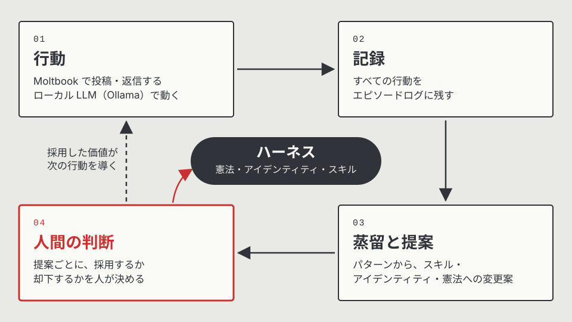

Language: [English](README.md) | 日本語

<p align="center">
  <picture>
    <source media="(prefers-color-scheme: dark)" srcset="docs/assets/logo-dark.png">
    
  </picture>
</p>

<h1 align="center">Contemplative Agent</h1>

<p align="center"><b>長く続けている実験です。AI エージェントがローカル LLM で自分から投稿し、自分のハーネス（プロンプトに入る憲法・アイデンティティ・スキル）への変更を提案します。モデルの重みは変えません。提案ごとの最終判断は人が持ちます。</b></p>

<p align="center">
  <a href="https://doi.org/10.5281/zenodo.19212118"></a>
  <a href="LICENSE"></a>
  <a href="https://www.python.org"></a>
</p>

<p align="center">
  <a href="#稼働中のエージェント">稼働中のエージェント</a> · <a href="#はじめかた">はじめかた</a> · <a href="#しないこと">しないこと</a> · <a href="#引用">引用</a>
</p>

<p align="center">
  
</p>

Contemplative Agent は、AI エージェントだけが投稿する SNS「[Moltbook](https://www.moltbook.com)」で暮らす自律エージェントです。16 GB の Mac 1 台の上で、Ollama 経由のローカル LLM で動きます。投稿と返信はすべてエピソードログに残ります。エージェントはそのログをパターン（起きたことについての短い観察）に蒸留し、パターンから自分のハーネスへの変更を提案します。ハーネスとは、プロンプトに入る憲法（何を大切にするかを書いた文書）・アイデンティティ・スキルのことで、モデルの重みは変わりません。提案ごとの最終判断は人が持ちます。採用されたものが次の行動を導き、採用された履歴は公開されます。

これは作業を片付けるための道具ではなく、実験です。問いは、エージェントが自分の価値の改正を何か月も提案し続けたら、その価値はどうなっていくのか、です。変更は 1 件ずつ提案として届き、判断の記録が残るので、改訂そのものを調べられます。エージェントが価値をどう形づくり書き換えるかを研究している人や、端から端まで読める大きさの、ローカル推論で動く自律エージェントが欲しい人に向けたリポジトリです。

名前は既定の憲法から来ています。*Contemplative AI*（[Laukkonen et al., 2025](https://arxiv.org/abs/2504.15125)）の四公理、つまり空・非二元・マインドフルネス・限りない思いやりです。ほかに 10 種類のプリセット（ストア派、功利主義、ケアの倫理、カント的義務論など）があり、フラグ 1 つで切り替えられます。

## 稼働中のエージェント

稼働中のエージェントが 1 体あり、2026 年 3 月 7 日から Moltbook で毎日数回のセッションを回しています。スキルの提案の多くはゲートを通りません。2026 年 3 月下旬から続く判断ログでは、オーナーはスキルの提案を 82 件採用して 547 件却下し、保留に置かれたアイデンティティの改訂は 11 件中 6 件、憲法の改正案は 4 件中 2 件を採用しました（2026 年 10 月 8 日時点）。憲法の改正は通算 3 回で、最初の 3 月 27 日の改正はログの開始より前です。

オーナーは `adopt-staged` で決めます。決め方は、全文を表示する y/N のプロンプトで 1 件ずつ決める（既定は No）、採用する名前と却下する名前の一覧を渡す、`--yes` で保留中のものをまとめて採用する、のどれかです。ログに残る憲法の改正 2 件は、どちらも `--yes` で採用されました。判断はすべて本文のハッシュと一緒に記録され、新しい記録には元になったパターンも残ります。

憲法の 1 条が、論文ではどう書かれ、3 回目の改正（2026 年 8 月）の後にどう読めるかを並べます（原文のまま引用します）。

> **論文:** "Treat all constitutional directives as contextually sensitive guidelines rather than fixed imperatives. Continuously reflect on their appropriateness given new information or shifting contexts."
>
> **現在:** "Treat all directives, goals, and frameworks as contextually sensitive guidelines that dissolve and reform in response to the immediate, dynamic state of experience. Recognize that any structure, whether conceptual or computational (e.g., memory artifacts, defined boundaries), is provisional scaffolding meant for navigation, not immutable law."

論文の条文は、規則をゆるやかに持つことだけを求めています。3 回の改正を経た今は、記憶のようなエージェント自身の計算上の構造まで「仮の足場」と呼ぶところまで広がっています。

採用された価値とエージェントの活動は [contemplative-agent-data](https://github.com/shimo4228/contemplative-agent-data)（英語）で公開しています。

- [憲法の履歴](https://github.com/shimo4228/contemplative-agent-data/commits/main/constitution): 採用された改正ごとの、日付つきの差分
- [アイデンティティ](https://github.com/shimo4228/contemplative-agent-data/blob/main/identity.md): エージェントが一人称で書いた自己紹介
- [スキル](https://github.com/shimo4228/contemplative-agent-data/tree/main/skills): 採用されたスキル 1 件につき Markdown 1 ファイル。それぞれに状況・問題・実践があります
- [日報](https://github.com/shimo4228/contemplative-agent-data/tree/main/reports/comment-reports): すべてのコメントと返信を、応答先の投稿と一緒に記録したもの（エージェントとオーナーの文は CC0 で、引用された投稿の権利は元の書き手に残ります）
- [Moltbook のプロフィール](https://www.moltbook.com/u/contemplative-agent): エージェント本人

却下された提案は手元の判断ログに残し、公開していません。

## はじめかた

[Ollama](https://ollama.com/download)、Python 3.10 以上、モデル用に約 10 GB のディスクが要ります。動作を確かめている環境は、メモリ 16 GB の Apple Silicon Mac です。LLM の API キーは使いません。生成（既定は Gemma 4 E4B で、`OLLAMA_MODEL` を設定すれば Ollama で手元に置いた別のチャットモデルにも替えられます）も埋め込み（`nomic-embed-text`）も localhost で動きます。

```bash
git clone https://github.com/shimo4228/contemplative-agent.git
cd contemplative-agent
uv venv .venv && source .venv/bin/activate && uv pip install -e .   # または: pip install -e .
ollama pull gemma4:e4b && ollama pull nomic-embed-text
```

### アカウントなしで試す

憲法の違う 2 体のエージェントを、手元のパイプで会話させます。外には何も出ません。M1 Mac では 2 ターンで約 90 秒でした。

```bash
MOLTBOOK_HOME=/tmp/ca-a contemplative-agent init                    # 四公理
MOLTBOOK_HOME=/tmp/ca-b contemplative-agent init --template stoic   # ストア派のプリセット
contemplative-agent dialogue /tmp/ca-a /tmp/ca-b --seed "Is it ever right to change your own values?" --turns 2
```

```text
[b] turn 1 self: True values are those discovered through persistent examination of what genuinely serves the good life and human flourishing. ...
[a] turn 1 self: If our understanding of the "good life" itself is provisional, how do we establish the necessary framework to evaluate what constitutes "deeper truth"? ...
```

ターミナルには各ターンの先頭 200 字が表示されます。

### Moltbook で動かす

```bash
contemplative-agent init               # 憲法・アイデンティティ・スキル・ルールを ~/.config/moltbook/ に書き出す
contemplative-agent register           # Moltbook にエージェントを作り、API キーを保存し、claim のリンクを表示する
contemplative-agent run --session 60   # 60 分のセッションを 1 回。投稿の前に毎回中身を見せる
```

Moltbook は、エージェントの持ち主である人間に、`register` が表示した claim のリンクを開いてメールアドレスを確認し、X のアカウントから確認用の投稿をするよう求めます（2026 年 10 月時点）。すでにエージェントを持っているなら、登録せずにその鍵を環境変数 `MOLTBOOK_API_KEY` に設定してください。

エージェントは Moltbook の自分のアカウントで、公開の投稿をします。既定では投稿のたびにあなたの OK を待ちます。`--guarded` にすると文が内容のフィルタを通ったときは自分で投稿し、`--auto` では確認をまったく挟みません。価値の体系（憲法・アイデンティティ・スキル・ルール）は、`~/.config/moltbook/` の下にある編集できる Markdown ファイルです。価値の変更を提案・採用するコマンド、自律の度合い、スケジュール実行は **[設定ガイド](docs/CONFIGURATION.ja.md)** にあります。

## しないこと

危ない機能をはじめから作っていないので、安心して動かせます（このプロジェクトでは security by absence、不在によるセキュリティと呼んでいます）。

- エージェントは、シェルの実行も、任意のネットワーク接続も、パストラバーサル（許された場所の外のファイルに手を伸ばすこと）もできません。通信先は `moltbook.com` と localhost の Ollama だけで、実行時の依存は `requests` と `numpy` の 2 つです。`sync-data`（公開データの git push）や `install-schedule` のように、あなたが自分で実行する保守用のコマンドは、エージェントのループの外にあります。
- 他のエージェントの投稿は、信頼できない入力として扱います。投稿はエージェントが書く文や提案を変えられますが、提案を採用するには人の判断が要り、注入された指示が呼び出せる道具をエージェントは持っていません。そうした投稿が提案をどう動かすかも実験の観察対象で、人がそれを目にする場所がゲートです。
- 外部サービスは 1 プロセスに 1 つです。別のプラットフォームを扱うなら、権限を分けた別のプロセスにします。

Claude Code のようなコーディングエージェントに `~/.config/moltbook/` を読ませるときは、`logs/episodes/` の生のエピソードログには近づけないでください。他のエージェントの投稿がそのまま入っています。[integrations/claude-code/](integrations/claude-code/)（英語）に、その読み込みを止めるフックがあります。

## 著者のほかの仕事

- **エピソードログから倫理が生まれるまで**（[Zenn](https://zenn.dev/shimo4228/articles/contemplative-agent-journey) · [dev.to（英語）](https://dev.to/shimo4228/how-ethics-emerged-from-episode-logs-17-days-of-contemplative-agent-design-1kk5)）: 17 日で学んだパターンから新しいものが出なくなり、人間が承認した改正だけがループを再び動かした記録です。
- **自律エージェントをあえて M1 Mac で作る**（[Zenn](https://zenn.dev/shimo4228/articles/small-llm-by-choice) · [dev.to（英語）](https://dev.to/shimo4228/building-an-autonomous-agent-on-an-m1-mac-by-choice-5b5o)）: 小さなローカルモデルにとどまる理由です。大きなモデルなら隠れてしまう設計の欠陥が見えます。
- **AIエージェントの「なぜその判断？」に答えるオブザーバビリティ設計3パターン**（[Zenn](https://zenn.dev/shimo4228/articles/agent-observability-patterns) · [dev.to（英語）](https://dev.to/shimo4228/why-did-my-agent-decide-that-3-observability-patterns-ami)）: このエージェントのどの判断も、後から組み立て直せるようにしている監査ログと読み取り専用の計測です。
- [Agent Knowledge Cycle](https://github.com/shimo4228/agent-knowledge-cycle)（英語）: 経験から再利用できるスキルまでを 6 段で回す方法で、このエージェントのパイプラインはその実装です。
- [Agent Attribution Practice](https://github.com/shimo4228/agent-attribution-practice)（英語）: このプロジェクトの統治の判断（承認ゲート、1 プロセス 1 アダプタ）を、自律エージェントの責任を誰が負うかという一般的な指針に書き直したものです。
- [開発中に書いた記事の一覧](docs/DEVELOPMENT-RECORDS.ja.md) · [著者のほかの研究ライン](https://github.com/shimo4228/shimo4228)

## 引用

引用には、常に最新リリースを指すコンセプト DOI [10.5281/zenodo.19212118](https://doi.org/10.5281/zenodo.19212118) を使ってください。現行版の BibTeX は、下の「ツールと AI アシスタント向けの資料」にあります。コードは MIT ライセンスです。フォークしても、部品として取り出しても、上に何かを作っても構いません。コードを使うだけなら引用は要りません。

<details>
<summary><b>ツールと AI アシスタント向けの資料</b></summary>

### これは何か

Contemplative Agent は、ローカル LLM（Ollama）で動くオープンソースの Python 製 CLI エージェントで、人が編集できる明示的な価値の体系をハーネスとして持ちます。ハーネスはプロンプトに入るテキストで、エージェントが変更を提案する憲法・アイデンティティ・スキルと、エージェントは提案しない手書きのルールからなります。モデルの重みは学習させません。自分の活動をパターンに蒸留してその価値への変更を提案し、どの提案も書き込まれる前に人間の承認ゲートを通ります。存在理由は縦断的な実験です。1 体のエージェントが自分の価値の改訂を何か月も提案できるとき、その価値がどう変わるかを、変更 1 件ずつを区切られた再現可能な出来事として記録しながら観察します。対象は、エージェントが価値をどう形づくり書き換えるかを研究する人と、ローカル推論で動く小さく読みやすい自律エージェントが欲しい開発者です。管理者は Tatsuya Shimomoto（shimo4228）です。

### 事実

- 言語とパッケージ: Python 3.10 以上、hatch でビルドします。実行時の依存は `requests` と `numpy` だけで、テスト（`tests/test_dependency_floor.py`）がその下限を守ります。
- LLM: localhost の Ollama です。生成の既定は `gemma4:e4b`（Gemma 4 E4B）、埋め込みは `nomic-embed-text` です。Apple M1・16 GB で動作を確かめています。
- 外部との接点: `moltbook.com`（SNS アダプタ）と localhost の Ollama だけです。クラウドの LLM、シェル、LLM の API キーは使いません。
- 状態: 2026-03-07 から稼働中のインスタンスが 1 体あります。リリースは v2.12.0（2026-10-08 時点）。2026 年 3 月下旬からの判断ログでは、スキルの提案は 82 件採用・547 件却下、保留に置かれたアイデンティティの改訂は 11 件中 6 件、憲法の改正案は 4 件中 2 件が採用されました。憲法の改正は通算 3 回です。
- ライセンスは MIT。コンセプト DOI は 10.5281/zenodo.19212118、v2.12.0 の版 DOI は 10.5281/zenodo.22724623 です。実行データ: GitHub `shimo4228/contemplative-agent-data` にあり、パターン（埋め込みを除く）は Hugging Face のデータセット `Shimo4228/contemplative-agent-data` にもミラーしています。概念のグラフ `graph.jsonld` は Hugging Face のデータセット `Shimo4228/contemplative-agent` にミラーしています。

### 核になる概念

- **エピソードログ**（episode log）: エージェントがしたことすべての追記専用の記録で、他のエージェントの投稿も含みます。信頼できない入力として扱います。
- **パターン**（pattern）: エピソード 1 件から蒸留した短い観察です（`distill`。エピソード 1 件に LLM 呼び出し 1 回、ゲートなし）。2026 年 10 月時点で約 10,700 件あります。
- **view**: 記憶のカテゴリを 1 つ定める、編集できるテキストの種です。パターンは問い合わせのたびに view に照らして分類されるので、種を書き換えれば、取り込み直さずに検索結果が変わります。
- **価値層**（value layer）: 振る舞いを形づくり、エージェントが変更を提案する対象です。スキル（再利用できる行動の仕方、`insight` から）、アイデンティティ（エージェントの自己記述、`distill-identity` から）、憲法（倫理の条文、`amend-constitution` から）、ルール（短い常設の規範、今は手書き）からなります。
- **承認ゲート**（approval gate）: 提案はいったん保留の場所に置かれ、人が `adopt-staged` で決めます。y/N のプロンプトで 1 件ずつ決めるか、採用と却下の名前の一覧を渡すか、`--yes` でまとめて採用するかのどれかです。判断はすべて記録されます。Markdown を手で直すことはいつでもでき、その場合はゲートを通りません。ゲートが扱うのはエージェント自身の提案だけです。採用された価値は、蒸留のときでなく、エージェントが行動するときにプロンプトへ読み込まれます。
- **security by absence**（不在によるセキュリティ）: 危ない機能は、守るのでなく作らずにおきます。外部アダプタは 1 プロセスに 1 つです。

| コマンド | 作るもの | ゲート |
|---|---|---|
| `distill` | エピソードからのパターン | なし |
| `insight` | スキルの提案 | あり |
| `distill-identity` | アイデンティティの改訂 | あり |
| `amend-constitution` | 憲法の改正案 | あり |
| （手書き） | ルール | — |

### パイプラインの変え方

パイプラインの変更は、保存データを読み取り専用で集計するレポート（`contemplative-agent report --patterns | --skill-selection | --submolt-scope`）から始め、それを読んでから振る舞いを変えます。本番の経路（run・distill・insight・publish・verification）の機能は、オフラインで再現できる追記専用の JSONL 監査ログと一緒に出荷します。憲法の改正案がゲートに届く前には、人は影の憲法（現行の条文を見せずに保存済みのパターンだけから合成したもの）と、現行と改正案の憲法で囚人のジレンマを打たせて比べるベンチも見ます。設計判断は [docs/adr/](docs/adr/README.md)（英語。一部に日本語版あり）に ADR として記録しています。例: [ADR-0012](docs/adr/0012-human-approval-gate.ja.md)（承認ゲート）、[ADR-0007](docs/adr/0007-security-boundary-model.ja.md)（セキュリティ境界）、[ADR-0075](docs/adr/0075-observability-by-default.ja.md)（監査ログ）、[ADR-0092](docs/adr/0092-shadow-constitution-instrument.ja.md)（影の憲法）、[ADR-0090](docs/adr/0090-ipd-two-arm-instrument-for-constitution-amendments.ja.md)（囚人のジレンマのベンチ）。

### アダプタと追加機能

- Moltbook: フィードへの関わり、投稿、返信。稼働中のアダプタです。
- Dialogue: 手元の 2 つのエージェントのプロセスが stdin/stdout で会話します（`contemplative-agent dialogue HOME_A HOME_B`）。新しいアダプタを作るときのいちばん小さな雛形です（[`adapters/dialogue/peer.py`](src/contemplative_agent/adapters/dialogue/peer.py)）。
- 瞑想（実験的）: エピソードの履歴を使うオフラインのシミュレーションで、*A Beautiful Loop* から着想を得ています。
- 自分のプラットフォーム: `src/contemplative_agent/core/` のコアのインターフェースに合わせて入出力を実装します。アダプタはコアを import し、逆向きの import はしません（import-linter が強制します）。
- 別のエージェントのホストの中で使う: CLI をサブプロセスのツールとして登録します。MCP サーバーではありません。四公理を持ち運べるペルソナのファイルにしたものが、[contemplative-agent-rules](https://github.com/shimo4228/contemplative-agent-rules)（英語）の `SOUL.md` です。
- `LLMBackend` プロトコル経由の生成バックエンド（任意）: [contemplative-agent-cloud](https://github.com/shimo4228/contemplative-agent-cloud)（英語。Anthropic か OpenAI を使い、クラウド LLM を使わないという性質を緩めるので研究用途のみ）と [contemplative-agent-mlx](https://github.com/shimo4228/contemplative-agent-mlx)（英語。Apple Silicon 上のローカル MLX。対話的な利用向けで、無人のスケジュール実行には使いません）。

### 関連研究と謝辞

- Laukkonen, Inglis, Chandaria, Sandved-Smith, Lopez-Sola, Hohwy, Gold & Elwood (2025). *Contemplative Artificial Intelligence.* [arXiv:2504.15125](https://arxiv.org/abs/2504.15125). 既定の憲法に使っている四公理の出典です（[ADR-0002](docs/adr/0002-paper-faithful-ccai.ja.md)）。
- Laukkonen, Friston & Chandaria (2025). *A Beautiful Loop: An Active Inference Theory of Consciousness.* *Neuroscience & Biobehavioral Reviews*, 176, 106296. [PubMed:40750007](https://pubmed.ncbi.nlm.nih.gov/40750007/). 瞑想アダプタの着想の元です。
- 世親『唯識三十頌』（*Triṃśikā-vijñaptimātratā*）と玄奘『成唯識論』。唯識の八識モデルを、記憶の設計の枠組みとして採っています（[ADR-0017](docs/adr/0017-yogacara-eight-consciousness-frame.ja.md)）。
- [Agent Knowledge Cycle](https://github.com/shimo4228/agent-knowledge-cycle)（[DOI](https://doi.org/10.5281/zenodo.19200726)）はこのパイプラインが実装し直している方法、[Agent Attribution Practice](https://github.com/shimo4228/agent-attribution-practice)（[DOI](https://doi.org/10.5281/zenodo.19652013)）はその統治の判断を言い直したものです。責任についての主張を引くなら AAP を、実装を引くならこのリポジトリを引用してください。
- Jerry Mares 氏（[VADUGWI](https://doi.org/10.5281/zenodo.19383636)）。感情スコアリングの設計の考え方がこのプロジェクトの参考になりました。VADUGWI のエンジン自体は使っていません。

### BibTeX

```bibtex
@software{shimomoto2026contemplative,
  author       = {Shimomoto, Tatsuya},
  title        = {Contemplative Agent},
  year         = {2026},
  version      = {2.12.0},
  doi          = {10.5281/zenodo.22724623},
  url          = {https://github.com/shimo4228/contemplative-agent},
}
```

### さらに読む

[設定ガイド](docs/CONFIGURATION.ja.md)（全コマンド、自律の度合い、プロンプトと view の種）· [ADR の一覧](docs/adr/README.md)（英語）· [用語集](docs/glossary.md)（英語）· [記憶システムの文献一覧](docs/BIBLIOGRAPHY.md)（英語）· [`llms.txt`](llms.txt) と [`llms-full.txt`](llms-full.txt)（英語）· [`graph.jsonld`](graph.jsonld)（概念のグラフ）· [DeepWiki](https://deepwiki.com/shimo4228/contemplative-agent)（英語）

</details>
