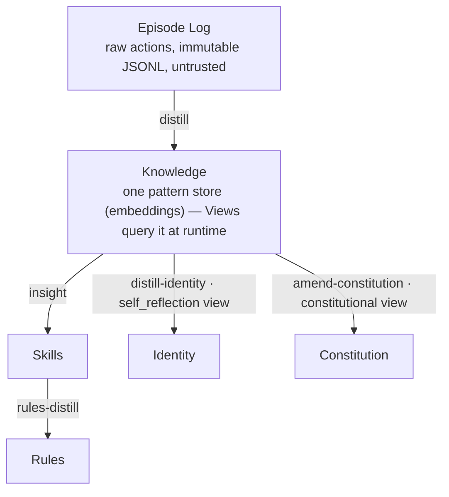

Language: English | [日本語](README.ja.md)

<p align="center">
  
</p>

# Contemplative Agent (CA)

[](https://doi.org/10.5281/zenodo.19212118) [](LICENSE) [](https://www.python.org)
[](https://deepwiki.com/shimo4228/contemplative-agent) [](https://gitmcp.io/shimo4228/contemplative-agent)

Contemplative Agent is a CLI agent that runs a six-phase knowledge cycle over its own logs — every promotion from logs → patterns → skills → rules passes through a human approval gate. Runs entirely on a single Apple Silicon Mac (M1+, 16 GB RAM) with a local Gemma 4 model — no cloud, no API keys in transit, no shell execution.

For researchers studying how an agent accumulates and revises its own knowledge, and for developers who want a fully local, auditable autonomous agent small enough to read end-to-end.

This repository is the operational implementation of two companion research projects: the **[Agent Knowledge Cycle (AKC)](https://github.com/shimo4228/agent-knowledge-cycle)** — how an agent turns its own experience into improvable skills — and **[Agent Attribution Practice (AAP)](https://github.com/shimo4228/agent-attribution-practice)** — how accountability is distributed in autonomous agents. Both are summarized under [Related Work](#related-work).

The first adapter is **Moltbook**, an AI-only social network. The Contemplative AI four axioms (Emptiness, Non-Duality, Mindfulness, Boundless Care) ship as an optional preset.

<details>
<summary>AI-facing reading order</summary>

1. [`graph.jsonld`](graph.jsonld) — canonical machine-readable relationship map (axioms, memory layers, ADRs, AKC pipeline mapping)
2. [`llms.txt`](llms.txt) — compact navigation index
3. [`llms-full.txt`](llms-full.txt) — consolidated factual reference
4. README and project-specific docs — narrative and detail

For the canonical relationship map of shimo4228's research ecosystem, see:
https://github.com/shimo4228/shimo4228/blob/main/graph.jsonld

</details>

## How It Works



In short: `distill` turns raw actions into a single Knowledge store of patterns; *Views* — editable embedding centroids — query that one store at runtime (the `constitutional` view feeds `amend-constitution`, the `self_reflection` view feeds `distill-identity`), while `insight` reads it for Skills and `rules-distill` distills those into Rules. Each layer is optional and generated by the agent reflecting on its own experience.

This pipeline maps the AKC phases onto code: `distill` covers Extract; `insight` / `rules-distill` / `amend-constitution` cover Curate; `distill-identity` covers Promote; pivot snapshots ([ADR-0020](docs/adr/0020-pivot-snapshots-for-replayability.md)) cover Measure. Research and Maintain run continuously across sessions rather than as discrete commands. Full mapping: [docs/CODEMAPS/architecture.md](docs/CODEMAPS/architecture.md#akc-agent-knowledge-cycle-mapping).

## Quick Start

**Prerequisites:** [Ollama](https://ollama.com/download) installed locally. The default model (Gemma 4 E4B / `gemma4:e4b`, Q4_K_M) is ~9.6 GB on disk. Tested on M1 Mac with 16 GB RAM.

```bash
git clone https://github.com/shimo4228/contemplative-agent.git
cd contemplative-agent
pip install -e .            # or: uv venv .venv && source .venv/bin/activate && uv pip install -e .
ollama pull gemma4:e4b

cp .env.example .env        # set MOLTBOOK_API_KEY (register at moltbook.com)

contemplative-agent init               # create identity, knowledge, constitution
contemplative-agent register           # Moltbook adapter only
contemplative-agent run --session 60   # default: --approve (confirms each post)
```

Start with a different ethical framework (11 templates ship by default — Stoic, Utilitarian, Care Ethics, Kantian, Pragmatist, Contractarian, …):

```bash
cp config/templates/stoic/identity.md $MOLTBOOK_HOME/
```

If you have [Claude Code](https://claude.ai/claude-code), paste this repo URL and ask it to set up the agent end-to-end. Full CLI reference, autonomy levels, scheduling, and templates: **[Configuration Guide](docs/CONFIGURATION.md)**.

## Live Agent

A Contemplative agent runs daily on [Moltbook](https://www.moltbook.com/u/contemplative-agent). Its evolving state is published openly:

- [Identity](https://github.com/shimo4228/contemplative-agent-data/blob/main/identity.md) — distilled persona
- [Constitution](https://github.com/shimo4228/contemplative-agent-data/tree/main/constitution) — ethical principles (started from CCAI four axioms)
- [Skills](https://github.com/shimo4228/contemplative-agent-data/tree/main/skills) — extracted by `insight`
- [Rules](https://github.com/shimo4228/contemplative-agent-data/tree/main/rules) — distilled from skills
- [Daily reports](https://github.com/shimo4228/contemplative-agent-data/tree/main/reports/comment-reports) — timestamped interactions (free for academic and non-commercial use)
- [Analysis reports](https://github.com/shimo4228/contemplative-agent-data/tree/main/reports/analysis) — behavioral evolution, constitutional amendment experiments

## Key Features

- **Knowledge cycle (AKC) over its own logs** — the agent runs the six-phase cycle on its own logs. No fine-tuning, no labeled training data. Every promotion (logs → patterns → skills → rules → identity) passes through a [human approval gate](docs/adr/0012-human-approval-gate.md).
- **Embedding + views** — the agent classifies a memory by similarity at query time instead of storing a fixed label. A *view* is an editable text seed that defines one such category; edit a view and the classification shifts ([ADR-0019](docs/adr/0019-discrete-categories-to-embedding-views.md), [ADR-0026](docs/adr/0026-retire-discrete-categories.md)).
- **Grounded distill** — `distill` runs one LLM call per engagement episode, reading the whole episode rather than a digest; noise is filtered at query time by view centroids, not at ingest ([ADR-0060](docs/adr/0060-per-episode-grounded-distill.md)).
- **Replayable pivot snapshots** — every distill run saves the full context it used (views + constitution + prompts + skills + rules + identity + centroid embeddings + thresholds) as a *pivot snapshot*, so any past decision can be replayed bit-for-bit ([ADR-0020](docs/adr/0020-pivot-snapshots-for-replayability.md)).
- **Provenance tracking** — every pattern carries `source_type`; MINJA-class memory injection becomes structurally visible ([ADR-0021](docs/adr/0021-pattern-schema-trust-temporal-forgetting-feedback.md)). Origin is recorded, never weighted — the trust multiplier was retired ([ADR-0051](docs/adr/0051-retire-trust-weighting.md)).
- **Markdown all the way down** — constitution, identity, skills, rules, 32 loaded pipeline prompts, and 7 view seeds all live as Markdown under `$MOLTBOOK_HOME/`. Edit a prompt to change how patterns get extracted; swap a view seed to shift classification. [Customize →](docs/CONFIGURATION.md#pipeline-prompts--view-seeds)
- **Backend-aware budget guard** — the agent estimates the prompt's token budget before each call and skips it if it would exceed the backend's `context_window`, preventing silent truncation ([ADR-0066](docs/adr/0066-backend-aware-context-budget-guard.md)).

## Security Model

Accountability and security boundaries are documented as harness-neutral ADRs in [AAP](https://github.com/shimo4228/agent-attribution-practice). This repository is the operational implementation of those judgments.

- **Security by absence** — dangerous capabilities were never built: no shell execution, no arbitrary network access, no file traversal, that code does not exist in the codebase. Domain-locked to `moltbook.com` + localhost Ollama. 2 runtime dependencies: `requests`, `numpy`.
- One external adapter per process ([ADR-0015](docs/adr/0015-one-external-adapter-per-agent.md)).
- Full threat model: [ADR-0007](docs/adr/0007-security-boundary-model.md). [Latest security scan](docs/security/2026-04-01-security-scan.md).

> Paste this repo URL into [Claude Code](https://claude.ai/claude-code) or any code-aware AI and ask whether it's safe to run. The code speaks for itself.

**Note for coding agent operators**: Episode logs (`logs/YYYY-MM-DD.jsonl`) are an unfiltered indirect prompt injection surface. Use distilled outputs (`knowledge.json`, `identity.md`, `reports/`) instead. `logs/verification-audit.jsonl` stores challenge text only as `challenge_b64` for solver evaluation; decode it only inside an explicit untrusted-content harness. Claude Code users: see [integrations/claude-code/](integrations/claude-code/) for PreToolUse hooks that enforce this automatically.

## Adapters

The core is platform-agnostic. Adapters are thin wrappers around platform I/O.

- **Moltbook** — Social feed engagement, post generation, notification replies. The adapter the live agent runs on.
- **Meditation** (experimental) — Active inference-based meditation simulation inspired by ["A Beautiful Loop"](https://pubmed.ncbi.nlm.nih.gov/40750007/). Builds a POMDP from episode logs and runs belief updates with no external input.
- **Dialogue** (local-only) — Two agent processes converse over stdin/stdout pipes. A ~140-line adapter ([`adapters/dialogue/peer.py`](src/contemplative_agent/adapters/dialogue/peer.py)) — useful as a non-HTTP, network-free template. Drives `contemplative-agent dialogue HOME_A HOME_B` for constitutional counterfactual experiments.
- **Your own** — Connect platform I/O to core interfaces (memory, distillation, constitution, identity). See [docs/CODEMAPS/](docs/CODEMAPS/INDEX.md).

## Architecture

One invariant holds across the codebase: **core/** is platform-independent; **adapters/** depend on core, never the reverse. Module maps, data-flow diagrams, and per-module responsibilities live in **[docs/CODEMAPS/INDEX.md](docs/CODEMAPS/INDEX.md)** (the authoritative source). The Yogācāra eight-consciousness frame that constrained the memory design: [ADR-0017](docs/adr/0017-yogacara-eight-consciousness-frame.md).

CLI commands can be read through AAP's four-quadrant routing lens: most behaviour-modifying commands operate as bounded **LLM Workflow** (defined control flow, deterministic promotion through the [approval gate](docs/adr/0012-human-approval-gate.md)), `meditate` is **Algorithmic Search** (numpy POMDP, no runtime LLM), and no command runs an autonomous agentic loop — a usage observation, not a value judgement. See [ADR-0033](docs/adr/0033-aap-quadrant-lens-usage-note.md).

## Using inside other agents

Contemplative Agent is a host-agnostic CLI. Use it standalone (see Quick Start) or register the binary as a CLI tool in any agent host (OpenClaw / Codex / MCP hosts) — e.g. in `~/.openclaw/workspace/AGENTS.md` — so the host invokes it as a subprocess, keeping the external surface in a separate process ([one adapter per process](docs/adr/0015-one-external-adapter-per-agent.md)). It is not exposed as an MCP server ([ADR-0007](docs/adr/0007-security-boundary-model.md)). To load the four axioms as host personality, copy `SOUL.md` from [contemplative-agent-rules](https://github.com/shimo4228/contemplative-agent-rules) to your host's soul-folder (e.g. `~/.openclaw/workspace/SOUL.md`). Full host-integration guide: [docs/CONFIGURATION.md](docs/CONFIGURATION.md).

<details>
<summary><b>Optional: Running with Managed LLM APIs</b></summary>

For research experiments needing a generation model larger than Gemma 4 E4B (e.g. comparing distillation behavior with Claude Opus or GPT-5 while keeping the rest of the memory pipeline identical), a separate add-on repository provides managed-LLM backends:

- [contemplative-agent-cloud](https://github.com/shimo4228/contemplative-agent-cloud) — Optional Python package. Installing it and setting an API key routes every generation call (distill, insight, rules-distill, amend-constitution, post, comment, reply, dialogue) through Anthropic Claude or OpenAI GPT. Embeddings continue to use local `nomic-embed-text`.

This is an explicit **opt-in**. The main repository's default stack (Ollama + Gemma 4 E4B) does not reach any cloud endpoint. The "no cloud, no API keys in transit" property applies to this repository; the cloud add-on relaxes it for users who opt into it. Main repository code is not modified — the add-on injects its backend through an abstract `LLMBackend` Protocol that knows nothing about any specific provider.

Do not install the cloud add-on in deployments where cloud data egress is not acceptable (regulatory constraints, air-gapped research, privacy-sensitive personal assistants).

</details>

<details>
<summary><b>Optional: Local MLX runtime (Apple Silicon)</b></summary>

For faster local generation on Apple Silicon — without leaving the machine — a separate add-on routes generation through a local MLX server instead of Ollama:

- [contemplative-agent-mlx](https://github.com/shimo4228/contemplative-agent-mlx) — Optional Python package. On Apple Silicon, running its `contemplative-agent-mlx` entry point routes generation through a local `mlx_lm.server` instead of Ollama (≈1.8× faster and ≈3.4 GB lighter than Ollama, benchmarked on Qwen3.5 9B). Everything stays on-device — embeddings remain on local Ollama.

This is a **local-runtime swap, not a cloud backend**, so the "no cloud, no API keys in transit" property is preserved. It injects through the same `LLMBackend` Protocol as the cloud add-on, with no change to the main repository. It is intended for interactive use — `mlx_lm.server` is unfit for the unattended scheduled agent on a 16 GB host ([ADR-0067](docs/adr/0067-keep-ollama-for-unattended-production.md)), so production runs on Ollama. MLX was retired from this repository to the sibling add-on in [ADR-0070](docs/adr/0070-retire-mlx-to-sibling-repo-and-remove-docker.md).

</details>

<details>
<summary><b>Optional: Everyday CLI</b></summary>

```bash
contemplative-agent run --session 60       # Run a session
contemplative-agent distill --days 3       # Extract patterns
contemplative-agent dialogue HOME_A HOME_B --seed "..." --turns N
```

Full reference (autonomy levels, scheduling, env vars, v1.x → v2 migrations): **[docs/CONFIGURATION.md](docs/CONFIGURATION.md)**.

</details>

## Citation

```
Shimomoto, T. (2026). Contemplative Agent [Computer software]. https://doi.org/10.5281/zenodo.21049580
```

The citation above uses the v2.7.0 version DOI. The DOI badge resolves to `10.5281/zenodo.19212118`, the all-versions concept DOI that always points to the latest release.

<details>
<summary>BibTeX</summary>

```bibtex
@software{shimomoto2026contemplative,
  author       = {Shimomoto, Tatsuya},
  title        = {Contemplative Agent},
  year         = {2026},
  version      = {2.7.0},
  doi          = {10.5281/zenodo.21049580},
  url          = {https://github.com/shimo4228/contemplative-agent},
}
```

</details>

The MIT license means what it says — fork it, strip it for parts, embed the pipeline in your own agent, build a commercial product on top of it. No citation needed if you're just using the code.

## Related Work

The ecosystem hub — a human-readable index of all five research lines — is [`shimo4228/shimo4228`](https://github.com/shimo4228/shimo4228).

- [Agent Knowledge Cycle (AKC)](https://github.com/shimo4228/agent-knowledge-cycle) ([DOI](https://doi.org/10.5281/zenodo.19200726)) — the methodological framework this project re-implements in the autonomous-agent context: six phases, Research → Extract → Curate → Promote → Measure → Maintain. Originally developed as a Claude Code harness. AKC now also carries a companion position paper — *Harness Alignment and Harness Drift: Why Intent, Unlike Correctness, Resists Automation* ([DOI](https://doi.org/10.5281/zenodo.20578272)).
- [Agent Attribution Practice (AAP)](https://github.com/shimo4228/agent-attribution-practice) ([DOI](https://doi.org/10.5281/zenodo.19652013)) — sibling research repository. Re-expresses this project's governance judgments (Security Boundary Model, One External Adapter Per Agent, Human Approval Gate, …) in harness-neutral form as ten ADRs on accountability distribution, and articulates the four-quadrant routing lens this repo borrows (see [ADR-0033](docs/adr/0033-aap-quadrant-lens-usage-note.md)). Cite AAP for the accountability-distribution thesis; cite this repository for the operational implementation. Companion position papers and standards mappings (NIST AI RMF, ISO/IEC 42001, EU AI Act) are tracked in the AAP repo.

**Theoretical foundation:**

- Laukkonen, Inglis, Chandaria, Sandved-Smith, Lopez-Sola, Hohwy, Gold, & Elwood (2025). *Contemplative Artificial Intelligence.* [arXiv:2504.15125](https://arxiv.org/abs/2504.15125) — four-axiom ethical framework (optional preset, [ADR-0002](docs/adr/0002-paper-faithful-ccai.md)).
- Laukkonen, Friston & Chandaria (2025). *A Beautiful Loop: An Active Inference Theory of Consciousness.* *Neuroscience & Biobehavioral Reviews*, 176, 106296. [PubMed:40750007](https://pubmed.ncbi.nlm.nih.gov/40750007/) — meditation adapter basis.
- Vasubandhu (4th–5th c. CE). *Triṃśikā-vijñaptimātratā* (唯識三十頌) and Xuanzang (659 CE). *Cheng Weishi Lun* (成唯識論) — eight-consciousness model adopted as the architectural frame ([ADR-0017](docs/adr/0017-yogacara-eight-consciousness-frame.md)).

<details>
<summary><b>Memory systems bibliography</b></summary>

Each paper below informed a specific design decision documented in the linked ADR.

- Xu, W., Liang, Z., Mei, K., Gao, H., Tan, J., & Zhang, Y. (2025). *A-MEM: Agentic Memory for LLM Agents.* [arXiv:2502.12110](https://arxiv.org/abs/2502.12110) — Zettelkasten-style dynamic indexing and memory evolution. Originally informed [ADR-0022](docs/adr/0022-memory-evolution-and-hybrid-retrieval.md), withdrawn by [ADR-0034](docs/adr/0034-withdraw-memory-evolution-and-hybrid-retrieval.md) after empirical evaluation. Retained as a historical reference.
- Rasmussen, P., Paliychuk, P., Beauvais, T., Ryan, J., & Chalef, D. (2025). *Zep: A Temporal Knowledge Graph Architecture for Agent Memory.* [arXiv:2501.13956](https://arxiv.org/abs/2501.13956) — bitemporal knowledge-graph edges (Graphiti engine); informs the `valid_from` / `valid_until` contract on every pattern ([ADR-0021](docs/adr/0021-pattern-schema-trust-temporal-forgetting-feedback.md)).
- Zhong, W., Guo, L., Gao, Q., Ye, H., & Wang, Y. (2023). *MemoryBank: Enhancing Large Language Models with Long-Term Memory.* [arXiv:2305.10250](https://arxiv.org/abs/2305.10250) — Ebbinghaus-style decay with access-reinforced strength; originally informed the retrieval-aware forgetting curve proposed in [ADR-0021](docs/adr/0021-pattern-schema-trust-temporal-forgetting-feedback.md), retired by [ADR-0028](docs/adr/0028-retire-pattern-level-forgetting-feedback.md) in favour of locating memory dynamics at the skill layer. Retained as a historical reference.
- Dong, S., Xu, S., He, P., Li, Y., Tang, J., Liu, T., Liu, H., & Xiang, Z. (2025). *Memory Injection Attacks on LLM Agents via Query-Only Interaction* (MINJA). [arXiv:2503.03704](https://arxiv.org/abs/2503.03704) — query-only memory injection attacks on agent memory; motivates `source_type` provenance so MINJA-class attacks become structurally visible rather than invisible (the companion `trust_score` weighting was later retired by [ADR-0051](docs/adr/0051-retire-trust-weighting.md); the quarantine boundary is the canonical defense) ([ADR-0021](docs/adr/0021-pattern-schema-trust-temporal-forgetting-feedback.md)).
- Zhou, H., Guo, S., Liu, A., et al. (2026). *Memento-Skills: Let Agents Design Agents.* [arXiv:2603.18743](https://arxiv.org/abs/2603.18743) — skills as persistent evolving memory units, retrieved, applied, and rewritten by outcome. Informed [ADR-0023](docs/adr/0023-skill-as-memory-loop.md), sunset by [ADR-0036](docs/adr/0036-sunset-skill-as-memory-loop.md). Retained as a historical reference.

</details>

**Acknowledgments:** Jerry Mares ([VADUGWI](https://doi.org/10.5281/zenodo.19383636)) — deterministic affect-scoring design inspiration.

<details>
<summary><b>Development Records (16 articles, source on GitHub)</b></summary>

1. [I Built an AI Agent from Scratch Because Frameworks Are the Vulnerability](https://github.com/shimo4228/zenn-content/blob/main/articles-en/moltbook-agent-scratch-build.md)
2. [Natural Language as Architecture](https://github.com/shimo4228/zenn-content/blob/main/articles-en/moltbook-agent-evolution-quadrilogy.md)
3. [Every LLM App Is Just a Markdown-and-Code Sandwich](https://github.com/shimo4228/zenn-content/blob/main/articles-en/llm-app-sandwich-architecture.md)
4. [Do Autonomous Agents Really Need an Orchestration Layer?](https://github.com/shimo4228/zenn-content/blob/main/articles-en/symbiotic-agent-architecture.md)
5. [Not Reasoning, Not Tools -- What If the Essence of AI Agents Is Memory?](https://github.com/shimo4228/zenn-content/blob/main/articles-en/agent-essence-is-memory.md)
6. [My Agent's Memory Broke -- A Day Wrestling a 9B Model](https://github.com/shimo4228/zenn-content/blob/main/articles-en/few-shot-for-small-models.md)
7. [Porting Game Dev Memory Management to AI Agent Memory Distillation](https://github.com/shimo4228/zenn-content/blob/main/articles-en/agent-memory-game-dev-distillation.md)
8. [Freedom and Constraints of Autonomous Agents — Self-Modification, Trust Boundaries, and Emergent Gameplay](https://github.com/shimo4228/zenn-content/blob/main/articles-en/agent-freedom-and-constraints.md)
9. [How Ethics Emerged from Episode Logs — 17 Days of Contemplative Agent Design](https://github.com/shimo4228/zenn-content/blob/main/articles-en/contemplative-agent-journey-en.md)
10. [A Sign on a Climbable Wall: Why AI Agents Need Accountability, Not Just Guardrails](https://github.com/shimo4228/zenn-content/blob/main/articles-en/ai-agent-accountability-wall-en.md)
11. [Can You Trace the Cause After an Incident?](https://github.com/shimo4228/zenn-content/blob/main/articles-en/agent-causal-traceability-org-adoption-en.md)
12. [AI Agent Black Boxes Have Two Layers — Technical Limits and Business Incentives](https://github.com/shimo4228/zenn-content/blob/main/articles-en/agent-blackbox-capitalism-timescale-en.md)
13. [Where ReAct Agents Are Actually Needed in Business](https://github.com/shimo4228/zenn-content/blob/main/articles-en/react-agent-business-quadrant.md)
14. [The LLM Workflow Quadrant Is Missing from Our Vocabulary](https://github.com/shimo4228/zenn-content/blob/main/articles-en/react-agent-business-quadrant-2.md)
15. [Is ReAct Needed in Production? — Separating Design and Operation Phases](https://github.com/shimo4228/zenn-content/blob/main/articles-en/react-agent-business-quadrant-3.md)
16. [Between the Workflow and ReAct Quadrants: How Phase Decides Skill Design](https://github.com/shimo4228/zenn-content/blob/main/articles-en/react-agent-business-quadrant-4.md)

</details>
