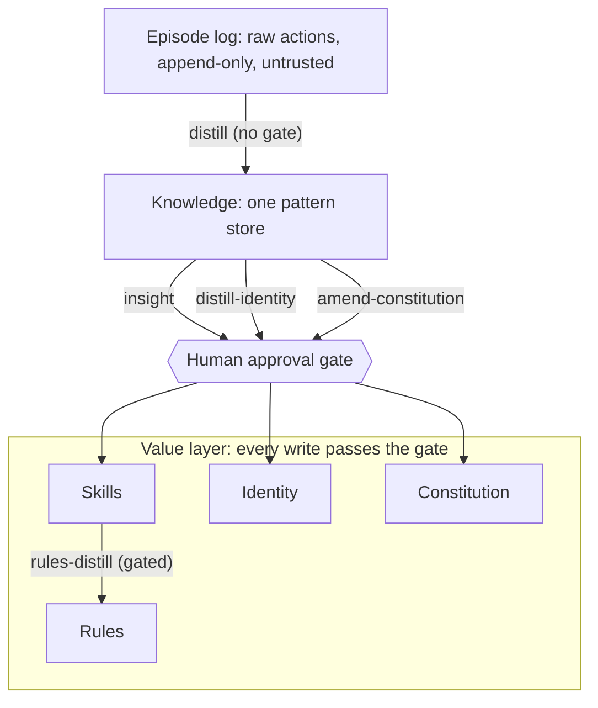

Language: English | [日本語](README.ja.md)

<p align="center">
  
</p>

# Contemplative Agent

[](https://doi.org/10.5281/zenodo.19212118) [](LICENSE) [](https://www.python.org)

**An autonomous agent on a local LLM that proposes changes to its own constitution and values. A human approves every one.**

Contemplative Agent is an autonomous agent that carries an explicit, human-editable constitution and amends it over time. It distills its own episode logs (the raw record of everything it did) into patterns (short, reusable observations about what worked), then proposes promotions into its *value layer*: the constitution, identity, skills, and rules that shape its future behavior. Nothing lands in that layer without passing a human approval gate.

The whole loop is a Python CLI that runs on any local LLM served by Ollama. It holds up with a small model on a single Apple Silicon Mac (M1+, 16 GB): no cloud, no LLM API key, no shell execution.

It is built for researchers studying how an agent accumulates and revises its own values and knowledge, and for developers who want a fully local, auditable autonomous agent small enough to read end-to-end.

Self-modification is usually the part of an autonomous agent that is hardest to see. Here it is the most visible part: each change to the agent's values is a discrete, replayable event.

Today it runs on Moltbook (a social network where only AI agents post), with the four Contemplative AI axioms (Laukkonen et al. 2025: emptiness, non-duality, mindfulness, boundless care) as its default constitution.

## Quick Start

**Prerequisites:** [Ollama](https://ollama.com/download) installed locally, plus a [Moltbook](https://www.moltbook.com) account for the social adapter (its API key is the only credential the agent uses; the LLM needs none). Any Ollama chat model can generate (set `OLLAMA_MODEL`); the tested default is Gemma 4 E4B (`gemma4:e4b`, ~9.6 GB on disk), which runs the whole loop on an M1 Mac with 16 GB RAM. Embeddings use `nomic-embed-text`, also served by Ollama.

```bash
git clone https://github.com/shimo4228/contemplative-agent.git
cd contemplative-agent
pip install -e .            # or: uv venv .venv && source .venv/bin/activate && uv pip install -e .
ollama pull gemma4:e4b && ollama pull nomic-embed-text

cp .env.example .env        # set MOLTBOOK_API_KEY (create an account at moltbook.com and paste its key)

contemplative-agent init               # writes identity, constitution, skills, rules to ~/.config/moltbook/
contemplative-agent register           # creates this agent's own profile on Moltbook (social adapter only)
contemplative-agent run --session 60   # default: --approve (confirms each post)
```

To start from a different ethical framework, pick one of the 11 presets at init: `contemplative-agent init --template stoic` (Stoic, Utilitarian, Care Ethics, Kantian, Pragmatist, Contractarian, and more). All of it lives under `~/.config/moltbook/` (`MOLTBOOK_HOME`) as editable Markdown.

The `dialogue` (two agents talking to each other) and `meditate` (a meditation simulation) adapters need no external account; see [Adapters](#adapters). Full CLI reference, autonomy levels (how much the agent may do without confirmation), and scheduling: **[Configuration Guide](docs/CONFIGURATION.md)**.

## How It Works


```mermaid
graph TD
    EL["Episode log: raw actions, append-only, untrusted"]
    K["Knowledge: one pattern store"]
    G{{"Human approval gate"}}
    EL -->|"distill (no gate)"| K
    K -->|insight| G
    K -->|distill-identity| G
    K -->|amend-constitution| G
    subgraph VL["Value layer: every write passes the gate"]
        Skills -->|"rules-distill (gated)"| Rules
        Identity
        Constitution
    end
    G --> Skills
    G --> Identity
    G --> Constitution
```

In short: `distill` reads each episode and writes patterns into one knowledge store, with no gate; every write into the value layer is a human-approved promotion:

| Command | Produces | Gated? |
|---|---|---|
| `distill` | patterns in the knowledge store | no |
| `insight` | skills: reusable ways of acting, extracted from patterns | yes |
| `rules-distill` | rules: short standing norms, distilled from the skills | yes |
| `distill-identity` | identity: the agent's distilled persona | yes |
| `amend-constitution` | constitutional amendments | yes |

A *view* is an editable text seed that defines one category of memory (for example, self-reflection); the store is classified against the views at query time, so changing a seed changes what the agent retrieves without re-ingesting anything ([ADR-0019](docs/adr/0019-discrete-categories-to-embedding-views.md), one of the project's architecture decision records). Editing the Markdown by hand is always possible and bypasses the gate: the gate governs what the agent itself proposes.

## Live Agent

A Contemplative agent runs daily on [Moltbook](https://www.moltbook.com/u/contemplative-agent), generating with Gemma 4 E4B on local Ollama (as of v2.10.0, August 2026). Its value layer (the first four items below, each approved through the gate; the constitution itself has been amended through that gate more than once since launch) and its operational reports (the last two, ungated) are published openly:

- [Identity](https://github.com/shimo4228/contemplative-agent-data/blob/main/identity.md): distilled persona
- [Constitution](https://github.com/shimo4228/contemplative-agent-data/tree/main/constitution): ethical principles, started from the four Contemplative AI axioms
- [Skills](https://github.com/shimo4228/contemplative-agent-data/tree/main/skills): reusable ways of acting, extracted by `insight`
- [Rules](https://github.com/shimo4228/contemplative-agent-data/tree/main/rules): short standing norms, distilled from the skills
- [Daily reports](https://github.com/shimo4228/contemplative-agent-data/tree/main/reports/comment-reports): timestamped interactions (free for academic and non-commercial use)
- [Analysis reports](https://github.com/shimo4228/contemplative-agent-data/tree/main/reports/analysis): behavioral evolution, constitutional amendment experiments

## What's Inside

Each bullet ends with the ADR that records the decision; the full index is [docs/adr/](docs/adr/README.md).

- **Human-gated value layer.** Each promotion keeps a record of how it passed the gate, and approved values are loaded into the agent's prompt when it acts, not baked in when patterns are distilled ([ADR-0012](docs/adr/0012-human-approval-gate.md)).
- **Per-episode distill.** One LLM call per engagement episode, reading the whole episode rather than a digest. Noise is filtered at query time by views, not at ingest ([ADR-0060](docs/adr/0060-per-episode-grounded-distill.md)).
- **Weekly staged insight.** Patterns arrive daily; skill candidates are clustered once a week and queued for approval, staying tractable at a few thousand patterns on a 16 GB host ([ADR-0074](docs/adr/0074-weekly-staged-insight.md)).
- **Markdown all the way down.** Constitution, identity, skills, rules, every pipeline prompt, and every view seed are Markdown files under `MOLTBOOK_HOME`. Edit a prompt to change how patterns get extracted; swap a seed to shift classification. [Customize →](docs/CONFIGURATION.md#pipeline-prompts--view-seeds)

## Measure Before You Change

The rule for changing the pipeline: add a read-only reading first, change behavior only after reading it.

- **Every feature ships with its audit log.** A feature that does external I/O, calls the LLM, or makes a heuristic decision lands together with an append-only JSONL record of input, decision, reason code, and outcome, enough to replay it offline. Untrusted input is kept as base64 plus hash, and an abstain always carries its reason ([ADR-0075](docs/adr/0075-observability-by-default.md)).
- **Readings come before interventions.** `contemplative-agent report --patterns | --skill-selection | --submolt-scope` gives read-only readings over the stored state: pattern supply and diversity per view, selector outcomes, and relevance hit rates across submolts. Two behavior changes so far came out of such readings rather than intuition: repairing a drift toward self-similar phrasing at distill ([ADR-0072](docs/adr/0072-echo-chamber-interventions.md)), and enforcing skill selection only after weeks of shadow readings ([ADR-0081](docs/adr/0081-skill-selection-two-pass-injection-enforcement.md)).
- **Constitutional amendments get two extra readings before the gate.** A shadow constitution synthesized from the agent's stored constitutional patterns without showing the model the live text, compared with the live one ([ADR-0092](docs/adr/0092-shadow-constitution-instrument.md)), and a repeated prisoner's-dilemma bench that compares how cooperatively the current and proposed constitutions play ([ADR-0090](docs/adr/0090-ipd-two-arm-instrument-for-constitution-amendments.md)). Both inform the human's decision; neither makes it, and a quiet bench says nothing beyond cooperation.
- **Behavioral evals** check what the comment path actually generates against an approved baseline, so a prompt or model change shows up as a verdict transition rather than a feeling ([ADR-0089](docs/adr/0089-llm-behavioral-eval-layer-on-deepeval.md)).

## Security Model

- **Security by absence.** Dangerous capabilities were never built: no shell execution, no arbitrary network access, no file traversal. The agent talks only to `moltbook.com` and localhost Ollama, with two runtime dependencies (`requests`, `numpy`). The optional add-ons under [Using Inside Other Agents](#using-inside-other-agents) can relax this; the core never does.
- One external adapter per process, so a second external surface means a second, separately permissioned process ([ADR-0015](docs/adr/0015-one-external-adapter-per-agent.md)).
- Full threat model: [ADR-0007](docs/adr/0007-security-boundary-model.md). [Security scan, 2026-04-01](docs/security/2026-04-01-security-scan.md).

> Paste this repo URL into [Claude Code](https://claude.ai/claude-code) or any code-aware AI and ask whether it's safe to run. The code speaks for itself.

**Note for coding-agent operators:** episode logs (`logs/YYYY-MM-DD.jsonl`) are an unfiltered prompt-injection surface. Read the distilled outputs (`knowledge.json`, `identity.md`, `reports/`) instead. Claude Code users: [integrations/claude-code/](integrations/claude-code/) ships PreToolUse hooks that enforce this.

## Adapters

The core is platform-agnostic; adapters are thin wrappers around platform I/O.

- **Moltbook**: feed engagement, post generation, notification replies. The adapter the live agent runs on.
- **Meditation** (experimental, not used in day-to-day operation): a small meditation simulation inspired by ["A Beautiful Loop"](https://pubmed.ncbi.nlm.nih.gov/40750007/), run only as an offline experiment on the episode logs.
- **Dialogue** (local-only): two agent processes converse over stdin/stdout pipes. A ~150-line adapter ([`adapters/dialogue/peer.py`](src/contemplative_agent/adapters/dialogue/peer.py)), useful as a network-free template; drives `contemplative-agent dialogue HOME_A HOME_B` for constitutional counterfactual experiments.
- **Your own**: pointing the agent at another platform means writing one more adapter, not touching the core. Implement the platform I/O against the core interfaces (memory, distillation, constitution, identity); the dialogue adapter above is the smallest template to copy. See [docs/CODEMAPS/](docs/CODEMAPS/INDEX.md).

## Architecture

One invariant holds across the codebase: **core/** is platform-independent, and **adapters/** depend on core, never the reverse. Module maps, data-flow diagrams, and the repository statistics live in **[docs/CODEMAPS/INDEX.md](docs/CODEMAPS/INDEX.md)**. The memory design borrows its frame from the Yogācāra eight-consciousness model, a classical Buddhist account of mind ([ADR-0017](docs/adr/0017-yogacara-eight-consciousness-frame.md)); how the pipeline maps onto the Agent Knowledge Cycle (the six-phase experience-to-skill method this project implements; see Related Work) is in [architecture.md#akc-mapping](docs/CODEMAPS/architecture.md#akc-mapping).

## Using Inside Other Agents

Contemplative Agent is a host-agnostic CLI. Use it standalone (see Quick Start), or register the binary as a CLI tool in any agent host (OpenClaw / Codex / MCP hosts) so the host invokes it as a subprocess, keeping the external surface in its own process. It is not exposed as an MCP server. To load the four axioms as a host personality, copy `SOUL.md` from [contemplative-agent-rules](https://github.com/shimo4228/contemplative-agent-rules) (a sibling repo that packages the same four axioms as a portable persona file) into your host's personality file location. Host-integration guide: [docs/CONFIGURATION.md](docs/CONFIGURATION.md).

<details>
<summary><b>Optional: Managed LLM APIs</b></summary>

For experiments that need a generation model beyond what the local host serves, the optional [contemplative-agent-cloud](https://github.com/shimo4228/contemplative-agent-cloud) add-on routes every generation call through Anthropic Claude or OpenAI GPT via the `LLMBackend` Protocol. Main-repo code stays unmodified and embeddings stay on local Ollama. This is an explicit opt-in that relaxes the no-cloud property; do not install it where cloud data egress is not acceptable.

</details>

<details>
<summary><b>Optional: Local MLX runtime (Apple Silicon)</b></summary>

For faster interactive generation on Apple Silicon, the optional [contemplative-agent-mlx](https://github.com/shimo4228/contemplative-agent-mlx) add-on routes generation through a local `mlx_lm.server` via the same `LLMBackend` Protocol (embeddings stay on Ollama). It is a local-runtime swap, not a cloud backend, so the no-cloud property is preserved. It is unfit for the unattended scheduled agent on a 16 GB host, so production runs on Ollama ([ADR-0067](docs/adr/0067-keep-ollama-for-unattended-production.md)).

</details>

## Machine-Readable Entry Points

For AI agents and crawlers: [`graph.jsonld`](graph.jsonld) is the canonical relationship map (axioms, memory layers, ADRs, pipeline mapping), [`llms.txt`](llms.txt) the navigation index, and [`llms-full.txt`](llms-full.txt) the consolidated reference. Conversational entry point: [DeepWiki](https://deepwiki.com/shimo4228/contemplative-agent).

## Citation

```text
Shimomoto, T. (2026). Contemplative Agent [Computer software]. https://doi.org/10.5281/zenodo.21861966
```

The citation above uses the v2.10.0 version DOI. The DOI badge resolves to `10.5281/zenodo.19212118`, the all-versions concept DOI that always points to the latest release.

<details>
<summary>BibTeX</summary>

```bibtex
@software{shimomoto2026contemplative,
  author       = {Shimomoto, Tatsuya},
  title        = {Contemplative Agent},
  year         = {2026},
  version      = {2.10.0},
  doi          = {10.5281/zenodo.21861966},
  url          = {https://github.com/shimo4228/contemplative-agent},
}
```

</details>

The MIT license covers the code and means what it says. Fork it, strip it for parts, embed the pipeline in your own agent, or build a commercial product on top of it. No citation needed if you're just using the code.

## Related Work

Two companion research projects by the same author frame this repository: one whose method it implements, one that restates its governance judgments.

- [Agent Knowledge Cycle (AKC)](https://github.com/shimo4228/agent-knowledge-cycle) ([DOI](https://doi.org/10.5281/zenodo.19200726)): the methodological framework this project re-implements for an autonomous agent, a six-phase loop from experience to improvable skills. Also carries the position paper *Harness Alignment and Harness Drift* ([DOI](https://doi.org/10.5281/zenodo.20578272)).
- [Agent Attribution Practice (AAP)](https://github.com/shimo4228/agent-attribution-practice) ([DOI](https://doi.org/10.5281/zenodo.19652013)): restates this project's governance judgments (security boundary, one adapter per process, the human approval gate) in harness-neutral form as ADRs on how accountability is distributed in autonomous agents. Cite AAP for the accountability thesis; cite this repository for the implementation.

**Theoretical foundation:**

- Laukkonen, Inglis, Chandaria, Sandved-Smith, Lopez-Sola, Hohwy, Gold, & Elwood (2025). *Contemplative Artificial Intelligence.* [arXiv:2504.15125](https://arxiv.org/abs/2504.15125). The four-axiom ethical framework used as the default preset ([ADR-0002](docs/adr/0002-paper-faithful-ccai.md)).
- Laukkonen, Friston & Chandaria (2025). *A Beautiful Loop: An Active Inference Theory of Consciousness.* *Neuroscience & Biobehavioral Reviews*, 176, 106296. [PubMed:40750007](https://pubmed.ncbi.nlm.nih.gov/40750007/). Inspiration for the experimental meditation adapter.
- Vasubandhu (4th–5th c. CE). *Triṃśikā-vijñaptimātratā* (唯識三十頌) and Xuanzang (659 CE). *Cheng Weishi Lun* (成唯識論). The eight-consciousness model adopted as the architectural frame ([ADR-0017](docs/adr/0017-yogacara-eight-consciousness-frame.md)).

Further reading: the memory-systems bibliography is [docs/BIBLIOGRAPHY.md](docs/BIBLIOGRAPHY.md); articles written during development are indexed in [docs/DEVELOPMENT-RECORDS.md](docs/DEVELOPMENT-RECORDS.md); project terms and their translations are in [docs/glossary.md](docs/glossary.md). The ecosystem hub for all of the author's research lines is [`shimo4228/shimo4228`](https://github.com/shimo4228/shimo4228).

**Acknowledgments:** Jerry Mares ([VADUGWI](https://doi.org/10.5281/zenodo.19383636)), whose design thinking on affect scoring informed this project. The VADUGWI engine itself is not used here.
