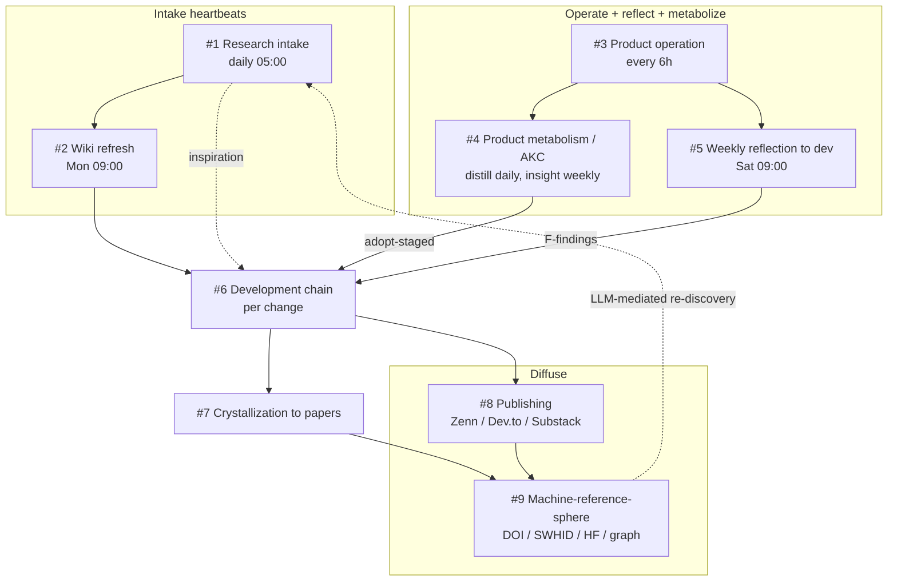

<!--
FRESHNESS
  generated: 2026-07-19
  source-commit: 7e3a742
  method: hand-authored from graph.jsonld (concept layer) + launchd plists + weekly/daily driver scripts + sibling-repo DOIs
  refresh: re-verify the master table rows against live assets (see "Sources & verification" at the bottom) after any change to schedules, pipelines, or the research-program repo set
-->

# Driving Cycles — Contemplative Agent Research Program

This document maps **how the project is driven forward**, not what the code looks like.
For file-level architecture see [CODEMAPS/INDEX.md](CODEMAPS/INDEX.md); for the concept-level
relationship graph see [../graph.jsonld](../graph.jsonld); for design decisions see [adr/](adr/README.md).

The program is **not a single repository**. It is a spiral of **nine interlocking cycles** that
span several repos and external channels. The backbone is:

> **operate → reflect + metabolize → develop → crystallize → diffuse**, with **research intake**
> feeding the top of the spiral.

A key property: **the automated legs run on their own (heartbeats), and the human gate sits almost
entirely on the *promotion edges*** — the step where a note, report, or candidate becomes a durable,
citable artifact (an ADR, a code change, a deposit, a publication). Machines produce the raw material
on a cadence; a human decides what is promoted.

The "shared workspace" is **the repositories themselves** — their domain docs plus the rules /
CLAUDE.md that route each working session to the right context. A terminal multiplexer (e.g. herdr)
only decides *where panes run*; the shared context lives in the repos.

---

## Master table

| # | Cycle | Cadence / trigger | Automated leg | Human gate (promotion edge) | Main artifacts | Home |
|---|---|---|---|---|---|---|
| 1 | **Research intake** | daily 05:00 — `com.shimomoto.daily-research` | source discovery → Vault notes + graph | wiki `/ingest`; harvest candidate → ADR / graph / code | `daily-research/` notes, `wiki/concept/` | sibling repo `daily-research/` |
| 2 | **Wiki refresh** | weekly Mon 09:00 — `com.shimo.wiki-refresh` | wiki maintenance / re-synthesis | — | Obsidian Vault `wiki/` | Vault |
| 3 | **Product operation** | every 6h, 00/06/12/18 JST — `com.moltbook.agent` | live sessions → episode logs / comment-reports | — | `logs/`, `reports/comment-reports/` | CA runtime (`MOLTBOOK_HOME`) |
| 4 | **Product metabolism (AKC)** | distill daily; insight weekly (staged) — `com.moltbook.distill` / `.insight` | Extract (distill) / Curate (insight) | `adopt-staged` (approval gate, ADR-0012) | `knowledge.json`, identity / skills / rules | CA + data repo |
| 5 | **Weekly reflection → dev** | weekly Sat 09:00 — `com.moltbook.weekly-analysis` | report A–E (observation only) | diagnosis (manual) → F1/F2/F3 → ADR / `.notes/TASKS.md` / code | `reports/analysis/weekly-*.md`, `-findings.md` | CA |
| 6 | **Development chain** | per change, on demand | planner → TDD → parallel reviewers (incl. codex-review) → doc-sync → verify | pre-commit diff approval | code, tests, ADR, CODEMAPS | CA |
| 7 | **Crystallization → papers** | on demand | essays → position-paper drafting | deposit (human) | position papers (DOI-registered) — index in [hub](https://github.com/shimo4228/shimo4228#papers) | AKC / AAP repos |
| 8 | **Diffusion (publishing)** | on demand | collect-context → article-writing → ja-to-en → substack | publish (human) | Zenn (ja) / Dev.to (en) / Substack essays | `zenn-content/` |
| 9 | **Machine-reference-sphere optimization** | periodic / on demand | gap-review / citation-sync / release-doi / hf-sync / `com.moltbook.sync-data` | deposit / DOI minting approval | DOI, SWHID, HF mirrors, graph citation edges | all repos |

---

## The spiral (how the cycles connect)

Read the dotted edges as the two loops that close the spiral: intake **inspires** new development,
and diffusion into the machine-reference sphere makes the work **re-discoverable** by the next
research-intake pass (LLM-mediated).

---

## Human gates = the promotion edges

Everything up to the raw artifact is automated; a human owns each of these promotions:

- **#1** wiki-harvest ledger candidate → `docs/adr/`, `graph.jsonld`, `glossary.md`, or code
- **#4** staged insight → identity / skills / rules / constitution (`adopt-staged`, ADR-0012)
- **#5** weekly F1/F2/F3 findings → ADR / `.notes/TASKS.md` / code change
- **#6** implemented diff → commit (after the Verify gate)
- **#7** drafted paper → Zenodo / SSRN deposit
- **#8** reviewed article → Zenn / Dev.to / Substack publish
- **#9** release → DOI minting; new external citations → `.zenodo.json` + graph edges

This is why adding driver-level automation rarely means "add a scheduler": the schedulers already
exist. The leverage is on how promotion decisions are surfaced, reviewed, and recorded.

---

## Shared substrate (the actual "shared room")

The cycles cohere because they read and write a common, layered context:

- **`graph.jsonld`** (concept layer) — the Research Program Hub federates the research lines and
  encodes the AKC Phase 1–6 → Contemplative Agent mapping, the 4 axioms, the 3 memory layers, the
  ADR catalog, Concepts, and ExternalReference citation edges.
- **CODEMAPS** (file layer) + **`docs/adr/`** (decision layer) + **CLAUDE.md / rules** (routing layer).

Any working session — in whatever pane it runs — picks up its domain's context from these files.
That routing layer, not a third-party workspace product, is what makes separate sessions a team.

---

## Papers & DOIs (pointer — not duplicated here)

The canonical index of the program's position papers, and every research line's concept DOI, lives
in the **hub repo**, which exists precisely to keep those citation pointers in one place. Copying
titles/DOIs into this file would go stale, so this doc only points:

- Papers → [shimo4228 research hub — **Papers**](https://github.com/shimo4228/shimo4228#papers)
- Per-line concept DOIs → the hub's ecosystem table ([shimo4228/shimo4228](https://github.com/shimo4228/shimo4228#readme))

Cycle #7 deposits into that index; Cycle #9 keeps the pointers in sync.

---

## Known asymmetry (recorded, not yet acted on)

The two **intake → dev** loops are wired unevenly:

- **Cycle #5 (weekly reflection → dev) is fully wired**: automated report → manual diagnosis →
  human promotion, with a visible trail in ADRs (e.g. ADR-0040 created the diagnosis skill; several
  later ADRs cite a specific weekly report as their trigger — grep `docs/adr/` for `weekly` to
  regenerate the current list rather than freezing it here).
- **Cycle #1's repo-promotion edge is not yet formalized for Contemplative Agent**: this repo's
  `CLAUDE.md` has no "Research Wiki Consultation" section, so `wiki-harvest` cannot resolve this
  repo's owned concept pages and falls back to a backfill signal. The daily-research heartbeat runs,
  but its landing edge into CA is informal.

This map records the asymmetry; deciding whether/how to close it is a separate step.

---

## Sources & verification

Each master-table row corresponds to a live asset. To re-verify after changes:

- Schedules: `ls ~/Library/LaunchAgents/com.*` and `config/launchd/*.plist`
- Cycle #5 driver: `scripts/weekly-analysis.sh`, `config/prompts/weekly-analysis.md`,
  `.claude/skills/weekly-report-diagnosis/SKILL.md`; outputs in `~/.config/moltbook/reports/analysis/`
- Cycle #1 driver: `daily-research/scripts/daily-research.sh`; consumers
  `~/.claude/skills/wiki-harvest/`, `~/.claude/skills/wiki-query/`
- Papers / DOIs (canonical index): [hub `## Papers`](https://github.com/shimo4228/shimo4228#papers); per-repo `CITATION.cff` + `.zenodo.json`
- Concept layer: [`../graph.jsonld`](../graph.jsonld)
