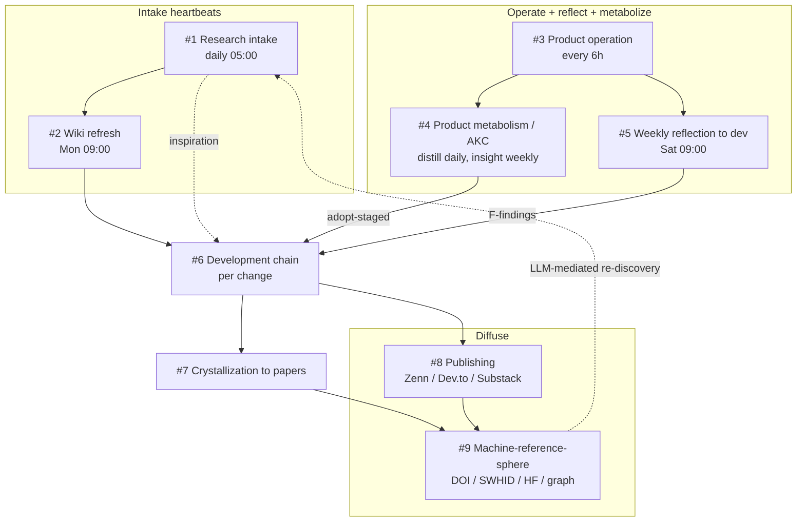

<!--
FRESHNESS
  generated: 2026-08-16
  source-commit: b74382a
  method: hand-authored from graph.jsonld (concept layer) + launchd plists + weekly/daily driver scripts + harness role contracts + sibling-repo DOIs; north-star section points to ADR-0080 (canonical)
  refresh: re-verify the master table rows and operating model against live assets (see "Sources & verification" at the bottom) after any change to schedules, pipelines, orchestration contracts, or the research-program repo set
-->

# Driving Cycles — Contemplative Agent Research Program

This document maps **how the project is driven forward**, not what the code looks like.
For file-level architecture see [CODEMAPS/INDEX.md](CODEMAPS/INDEX.md); for the concept-level
relationship graph see [../graph.jsonld](../graph.jsonld); for design decisions see [adr/](adr/README.md).

The program is **not a single repository**. It is a spiral of **nine interlocking cycles** that
span several repos and external channels. The backbone is:

> **operate → reflect + metabolize → develop → crystallize → diffuse**, with **research intake**
> feeding the top of the spiral.

A key property: **the automated legs run on their own (heartbeats), and the human gate sits almost
entirely on the *promotion edges*** — the step where a note, report, or candidate becomes a durable,
citable artifact (an ADR, a code change, a deposit, a publication). Machines produce the raw material
on a cadence; a human decides what is promoted.

The "shared workspace" is **the repositories themselves** — their domain docs plus the rules /
CLAUDE.md that route each working session to the right context. A terminal multiplexer (e.g. herdr)
only decides *where panes run*; the shared context lives in the repos.

---

## Operating model — persistent contracts, replaceable workers

Two different agent layers must not be conflated:

- The **runtime agent** is the Contemplative Agent product: it operates in Cycle #3, metabolizes
  experience into knowledge and value-layer candidates in Cycle #4, and becomes the subject of
  observation and diagnosis in Cycle #5.
- The **program workers** are the Claude Code / Codex sessions and scheduled scripts that operate
  the research program. A worker is replaceable: it may start with a fresh context, run one bounded
  role, write or review an artifact, and exit.

Program-level continuity therefore belongs to contracts and artifacts, not to a named worker's
private persona or conversation memory:

| Persistent concern | Canonical home | Operating consequence |
|---|---|---|
| Role identity | `CLAUDE.md`, rules, skills, and agent definitions | A different session or engine can perform the same role without redefining it |
| Compounding memory | reports, ADRs, CODEMAPS, task ledgers, and audit records | Later workers inherit durable artifacts rather than another worker's private recollection |
| Coordination | explicit input/output artifacts between cycles | The handoff survives the session that produced it |
| Review independence | author/reviewer separation in the development, writing, and paper chains | Review runs in a separate context; high-stakes paths add cross-model review where specified |
| Authority | the human promotion edges below | Workers propose, diagnose, implement, and review; a human promotes durable changes |

Cycle #5 is the clearest example. The unattended Saturday chain (`scripts/weekly-pipeline.sh`,
ADR-0085 / ADR-0098) runs **one** headless session (`/weekly-report`): observation-only A–E
synthesis, then diagnosis producing F1/F2/F3 findings, then candidate filing into the task
ledger — no repairs, no patches. Repairs travel through the task-triage loop (premise
verification → owner digest → worktree dispatch → human merge), and the value-layer decisions
happen in the Saturday `/weekly-gate` session over the findings and the per-week instrument
JSONs. Diagnostician, triage judge, implementer, and promoter remain distinct responsibilities;
the independence that used to live on session boundaries now lives on the ledger boundary
(findings are advisory; triage re-verifies premises before anything is built).

This model deliberately keeps execution identity lightweight. A session's useful result compounds
only after it lands in the appropriate shared artifact; the session itself is not an additional
source of truth.

---

## North star — what "done" means per layer

The program's desired end state is defined **per layer, as completion conditions — not as a
capability target** (canonical: [ADR-0080](adr/0080-north-star-layered-end-state.md); this section
only points there):

- **Mechanism layer (code)** — done = it stops moving; changes become repair-only
- **Value layer** (identity / constitution / skills / rules) — no destination; done = legible
  evolution continues, every change traceable and explicable offline
- **Research layer** — done = the founding questions answered and crystallized into papers,
  diffused into the machine-reference sphere (derivation = success)
- **Security layer** — done = absence preserved (succeeds by not changing)
- **Ending design** — a designed termination of the heartbeat; the final deliverable is the
  longitudinal record (dataset + papers), not the agent instance

Benchmarks may be derived from this definition as per-layer gates, but the definition itself is
not reducible to any benchmark suite (ADR-0080's benchmark non-reducibility clause).

---

## Master table

| # | Cycle | Cadence / trigger | Agent / automated leg | Human gate (promotion edge) | Main artifacts | Home |
|---|---|---|---|---|---|---|
| 1 | **Research intake** | daily 05:00 — `com.shimomoto.daily-research` | source discovery → Vault notes + graph | surfaced candidate (e.g. via `wiki-harvest`) → ADR / graph / code | `daily-research/` notes, `wiki/concept/` | sibling repo `daily-research/` |
| 2 | **Wiki refresh** | weekly Mon 09:00 — `com.shimo.wiki-refresh` | wiki maintenance / re-synthesis | — | Obsidian Vault `wiki/` | Vault |
| 3 | **Product operation** | every 6h, 00/06/12/18 JST — `com.moltbook.agent` | live sessions → episode logs / comment-reports | — | `logs/`, `reports/comment-reports/` | CA runtime (`MOLTBOOK_HOME`) |
| 4 | **Product metabolism (AKC)** | distill daily; insight weekly (staged) — `com.moltbook.distill` / `.insight`; identity monthly (staged by cycle 5's chain, ADR-0091); constitution amendment on due-reading, human-initiated (ADR-0090/0091; shadow readings as third gate material, ADR-0092) | Extract (distill) / Curate (insight) | `adopt-staged` (approval gate, ADR-0012) | `knowledge.json`, identity / skills / rules / constitution | CA + data repo |
| 5 | **Weekly reflection → dev** | weekly Sat 09:00 — `com.moltbook.weekly-pipeline` (+ `com.moltbook.watchdog`, ADR-0085 / ADR-0098) | unattended chain: materials → one `/weekly-report` session (A–E + diagnosis + candidate filing) → value-layer due check (+ monthly identity staging, ADR-0091) → dead-code scan → docs-consistency scan (ADR-0093) → never-selected reading | `/weekly-gate` Saturday session (`adopt-staged`, dead code, retirement) + task-triage loop for the filed candidates | `reports/analysis/weekly-*.md`, `-findings.md`, per-week instrument JSONs, `PIPELINE-STATUS.md` | CA |
| 6 | **Development chain** | per change, on demand | planner → TDD → parallel reviewers (incl. codex-review) → doc-sync → verify | pre-commit diff approval | code, tests, ADR, CODEMAPS | CA |
| 7 | **Crystallization → papers** | on demand | essays → position-paper drafting → independent parallel review → citation gate | deposit (human) | position papers (DOI-registered) — index in [hub](https://github.com/shimo4228/shimo4228#papers) | AKC / AAP repos |
| 8 | **Diffusion (publishing)** | on demand | collect-context → article-writing → editor / reviewer / fact-check → ja-to-en → substack | publish (human) | Zenn (ja) / Dev.to (en) / Substack essays | `zenn-content/` |
| 9 | **Machine-reference-sphere optimization** | periodic / on demand | citation-sync / release-doi / hf-sync / `com.moltbook.sync-data` | deposit / DOI minting approval | DOI, SWHID, HF mirrors, graph citation edges | all repos |

---

## The spiral (how the cycles connect)

Read the dotted edges as the two loops that close the spiral: intake **inspires** new development,
and diffusion into the machine-reference sphere makes the work **re-discoverable** by the next
research-intake pass (LLM-mediated).

---

## Human gates = the promotion edges

Automated and on-demand agent legs produce and review the candidate artifacts; a human owns each of
these promotions:

- **#1** research candidate (including a `wiki-harvest` ledger candidate) → `docs/adr/`,
  `graph.jsonld`, `glossary.md`, or code
- **#4** staged insight → identity / skills / rules / constitution (`adopt-staged`, ADR-0012)
- **#5** weekly F1/F2/F3 findings → ADR / task ledger (`.notes/tasks/`) / code change
- **#6** implemented diff → commit (after the Verify gate)

For Cycle #5, edge #4 is exercised in the Saturday `/weekly-gate` session over the findings
and instrument JSONs (ADR-0098 retired the decision packet), while edges #5–#6 travel through
the task-triage loop: the diagnosis files candidates, the owner adopts them at the triage
digest, and implemented diffs merge on the human's word. Every promotion stays human.

- **#7** drafted paper → Zenodo / SSRN deposit
- **#8** reviewed article → Zenn / Dev.to / Substack publish
- **#9** release → DOI minting; new external citations → `.zenodo.json` + graph edges

This is why adding driver-level automation rarely means "add a scheduler": the schedulers already
exist. The leverage is on how promotion decisions are surfaced, reviewed, and recorded.

---

## Shared substrate (the actual "shared room")

The cycles cohere because they read and write a common, layered context:

- **`graph.jsonld`** (concept layer) — the Research Program Hub federates the research lines and
  encodes the AKC Phase 1–6 → Contemplative Agent mapping, the 4 axioms, the 3 memory layers, the
  ADR catalog, Concepts, and ExternalReference citation edges.
- **CODEMAPS** (file layer) + **`docs/adr/`** (decision layer) + **CLAUDE.md / rules** (routing layer).

Any working session — in whatever pane it runs — picks up its domain's context from these files.
The session's private context is disposable and never authoritative: a conclusion that must survive
is written to the artifact layer appropriate to its role. That routing and artifact layer, not a
third-party workspace product, is what makes separate sessions a team.

---

## Papers & DOIs (pointer — not duplicated here)

The canonical index of the program's position papers, and every research line's concept DOI, lives
in the **hub repo**, which exists precisely to keep those citation pointers in one place. Copying
titles/DOIs into this file would go stale, so this doc only points:

- Papers → [shimo4228 research hub — **Papers**](https://github.com/shimo4228/shimo4228#papers)
- Per-line concept DOIs → the hub's ecosystem table ([shimo4228/shimo4228](https://github.com/shimo4228/shimo4228#readme))

Cycle #7 deposits into that index; Cycle #9 keeps the pointers in sync.

---

## Intake → development landing modes

The two intake paths close their loops with different degrees of procedural specificity:

- **Cycle #5 (weekly reflection → dev) has a fixed chain**: materials collection → one
  unattended `/weekly-report` session (A–E + diagnosis + candidate filing) → task-triage loop
  for repairs, `/weekly-gate` for value-layer promotion (ADR-0085 / ADR-0098), with a visible trail in ADRs
  (e.g. ADR-0040 created the diagnosis skill; several later ADRs cite a specific weekly report as
  their trigger — grep `docs/adr/` for `weekly` to regenerate the current list rather than
  freezing it here).
- **Cycle #1 (research intake → dev) is intentionally method-flexible**. `wiki-harvest` already
  provides one structured route from the read-only research wiki to a repo-local candidate ledger,
  but it is not the required or exclusive route. Direct consultation of the wiki, primary-source
  reading, or another research workflow may surface the same kind of candidate. The invariant is
  the landing discipline: trace the claim to a primary source, name a concrete repo destination,
  and leave promotion into ADR / graph / code to the human gate.

The fixed part is the evidence and promotion contract, not the tool used to surface a candidate.

---

## Sources & verification

Each master-table row corresponds to a live asset. To re-verify after changes:

- Schedules: `ls ~/Library/LaunchAgents/com.*` and `config/launchd/*.plist`
- Cycle #5 driver: `scripts/weekly-pipeline.sh` (wraps `scripts/weekly-analysis.sh` as its
  materials collector), `scripts/pipeline_watchdog.sh`,
  `scripts/docs_consistency_scan.py` (ADR-0093),
  `config/prompts/weekly-analysis.md` / `weekly-analysis-ja.md` / `principles.md`,
  `.claude/skills/weekly-report/SKILL.md`, `.claude/skills/weekly-gate/SKILL.md`;
  outputs in `~/.config/moltbook/reports/analysis/` (+ `PIPELINE-STATUS.md`,
  `logs/pipeline-metrics.jsonl`)
- Program-worker role and review contracts: `~/.claude/rules/common/agents.md`,
  `~/.claude/rules/common/planning.md`, and the `writing-ecosystem` / `paper-ecosystem` skills
- Cycle #1 driver: `daily-research/scripts/daily-research.sh`; consumers
  `~/.claude/skills/wiki-harvest/`, `~/.claude/skills/wiki-query/`
- Papers / DOIs (canonical index): [hub `## Papers`](https://github.com/shimo4228/shimo4228#papers); per-repo `CITATION.cff` + `.zenodo.json`
- Concept layer: [`../graph.jsonld`](../graph.jsonld)
